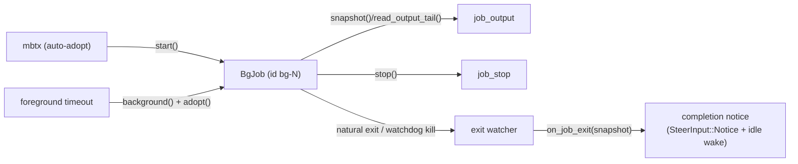

# Background Job Registry

`bobzhang/openseek/agent_tool/bgjobs` is the session-scoped registry of
background shell jobs. Each job wraps one shared
`@shell_exec.ShellExecution` (see `agent_tool/shell_exec`): the registry adds
ids, session-visible metadata, spill-file placement, exit watchers, and
push-completion hooks — it adds no second execution or output pipeline.

One `BgJobRuntime` is created per session (by `@agent.build_tools`) and shared
by `mbtx` (auto-adopted after its foreground grace period) and the `job_output`
and `job_stop` tools, so a job started in one turn is visible in every later
turn of the session. The registry carries no shell tool family.

## Lifecycle

- `start` spawns a job directly (one id reserved up front, so the job id and
  its spill file never diverge).
- `adopt` registers an *already running* execution — this is detach-on-timeout:
  a foreground command that outlived its `timeout_ms` is flipped to
  `Backgrounded` and adopted, so `job_output`/`job_stop` and the completion
  notice see it like any explicitly backgrounded job. The launch's sandbox
  metadata rides along so a source-write denial is still detected when the
  job's output is read later.
- Every child is spawned on the session task group: session teardown cancels
  the process. Cancellation reaches only the direct child (no process-group
  kill), so a daemonizing command can leave descendants.

## Output retention

Jobs use the sink's file-backed model: an inline preview up to the budget
(`max_output_chars`, matching the foreground default so a command
reads the same either way), full output in a per-job spill file under the
session's spill directory, a thirty-minute wall-clock lifetime cap (a reaped
job reports `killed_by_time_limit`, measured from process start so adopted
jobs keep their original deadline), and the hard-cap watchdog: a job that floods past
`hard_output_cap` (default 20M characters) is killed and reported as
`killed_by_output_limit` — never left burning CPU with its output dropped, and
never silently dead. Without a spill directory the runtime degrades to
memory-only jobs (bounded preview, rest dropped).

## Push-completion

The per-job watcher awaits the execution and calls `on_job_exit` exactly once
for a natural exit, the output watchdog, the wall-clock reaper, or an output
capture failure. A normal requested stop (`job_stop`, session teardown) fires
nothing: it is already user-visible. Capture failures still produce a notice
when they race a requested stop, so losing output is never hidden by that stop.
The `agent` package wires `on_job_exit` to queue a
`SteerInput::Notice` (lossless) and poke the serve loop, which is what makes
job completion *push* into the conversation instead of requiring the model to
poll — see the `mbtx` tool description and the system prompts, which teach
exactly that workflow.

## Snapshots

Consumers only ever see `BgJobSnapshot`, an immutable view carrying the status
(`Running`/`Exited(code)`/`Stopped`), the inline output preview, the `size`
counter for change detection, and the error-semantics flags
(`had_invalid_utf8`, sandbox metadata, `killed_by_output_limit`) that let
`job_output` report a background job with exactly the foreground path's error
behavior. The sink's own sequence number stays private and is not copied into
the snapshot.

Background adoption now materializes a configured output file before returning
its ID, including for an empty or small output. Foreground output stays in
memory until its existing cap or adoption. `BgJobSnapshot.output_file` is the
actual path (an adopted execution can keep its `fg-N.out` filename),
`output_persistent` describes its lifetime, and `output_error` reports capture
failures separately from the program outcome. File I/O errors are surfaced;
they no longer silently return the initial output head.

Standard durable `run`/`serve` sessions retain job logs below their session's
`jobs/<runtime-generation>` directory. Compiler/snippet scratch files still
follow the engine scope. No-session engines label their logs temporary.
