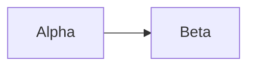

```javascript
const greeting = "Hello GitHub";
console.log(greeting);
```


```mermaid
flowchart LR
Alpha --> Beta
```

```d2
one -> two
```

```uml
@startuml
Alice -> Bob: Hello
@enduml
```

- [x] Completed task
- [ ] Pending task
