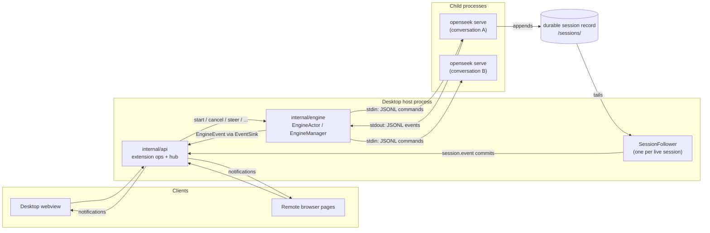
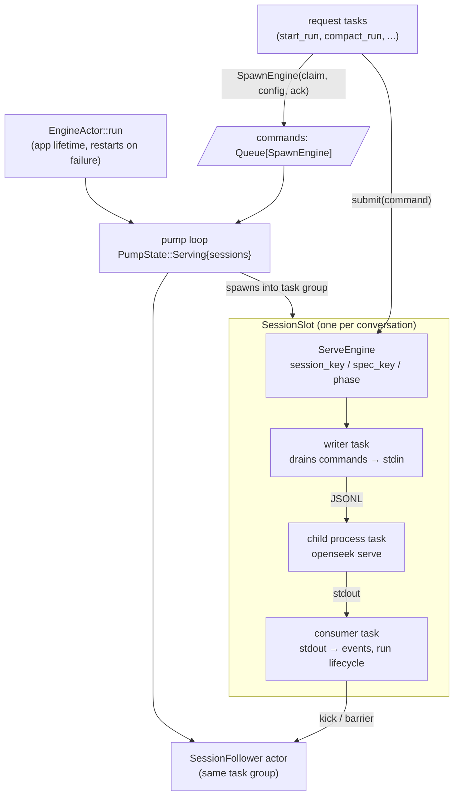
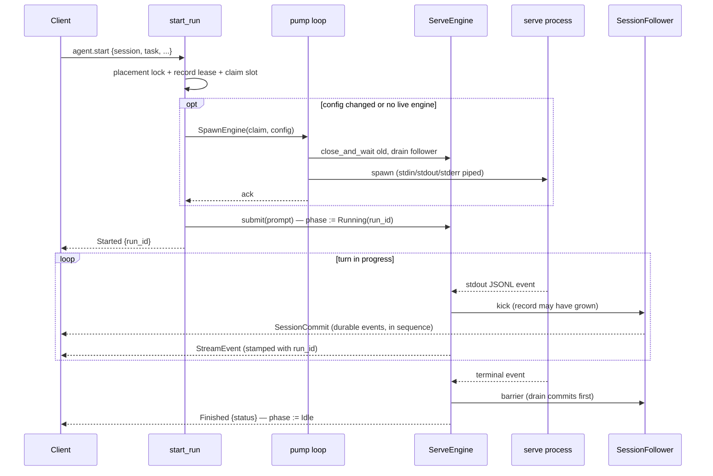
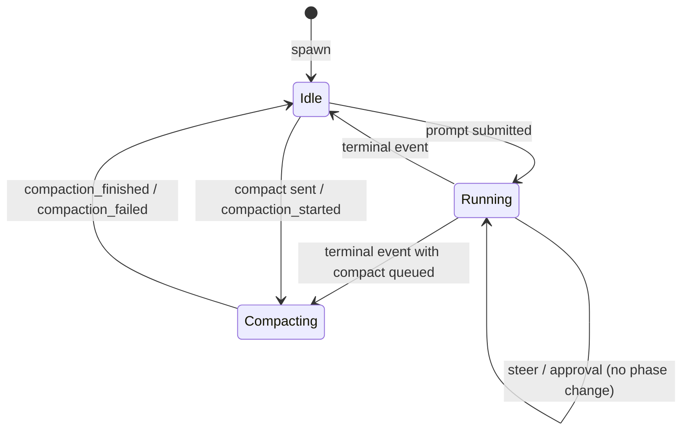
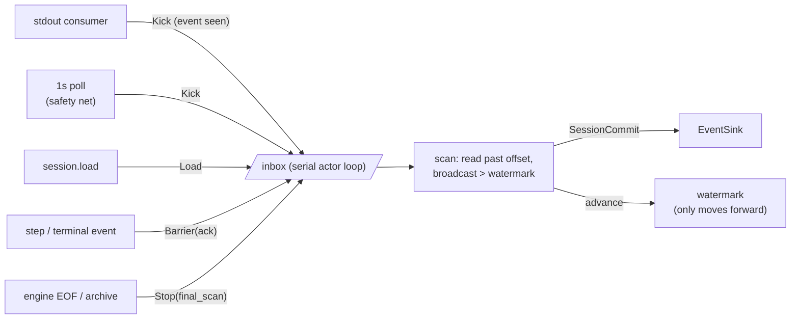
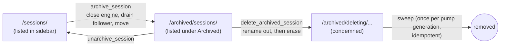

# Desktop Engine Host

`openseek_desktop/internal/engine` is the desktop host's engine layer: it owns
one persistent `openseek serve` process per conversation, feeds those processes
prompts over stdin, consumes their JSONL event streams, and tails each
conversation's durable record so committed transcript events reach every
connected client. It also owns the operations built around those processes —
session listing and loading, archiving, host-owned endpoint settings, and the
one-time global-store migration.

The package sits between the extension API layer and the engine executable:



## Package map

| File | Owns |
| --- | --- |
| `api.mbt` | The event vocabulary: `EngineEvent`, `EventSink`, `EngineError`, run statuses, submission-id normalization. |
| `engine.mbt` | The persistent-engine machinery: `ServeEngine`, `EnginePhase`, `EngineManager`, `EngineActor` and its pump loop, spawn/retire lifecycle. |
| `follower.mbt` | The session follower actor: tails the durable record and broadcasts `SessionCommit` events. |
| `ops.mbt` | The operations behind the extension ops: `start_run`, `cancel_run`, `steer_run`, `approve_run`, `compact_run`, `goal_run`, session/workspace queries. |
| `archive.mbt` | Moving a conversation's record between the live and archived stores, and sweeping condemned records under `archived/deleting`. |
| `config.mbt` | Turning a `start` payload into the validated `RunConfig` a serve process is spawned with. |
| `command.mbt` | Locating the engine executable across packaged and development layouts. |
| `settings.mbt` | Host-owned endpoint settings (`engine-settings.json`): provider, credentials, versioned atomic saves. |
| `migrate_global_store.mbt` | One-time relocation of legacy global-store conversations into the default workspace's store. |

## Process model

`EngineActor::run` is an app-lifetime task. Each of its generations opens one
structured task group that owns *every* child: serve processes, their stdin
writer and stdout consumer tasks, and the follower actors. Stopping the pump
tears all of them down wholesale; a failed generation is reported and
restarted after a short delay.

Requests never spawn processes themselves. An op that needs a (re)spawn posts a
`SpawnEngine` command to the manager's queue and waits for the pump to
acknowledge — a process must be owned by a task group that outlives individual
IPC requests. Everything else (stdin writes, phase transitions) happens
directly on the shared `EngineManager` state.



Key lifecycle facts, straight from `engine.mbt`:

- **One process serves every prompt of one conversation.** Turns are strictly
  sequential per conversation; different conversations run concurrently.
- **Idle engines stay alive for the app's lifetime.** The durable session makes
  killing them safe, but keeping them avoids a respawn-and-replay on every
  conversation switch.
- **A handle's identity is its process.** Cleanup paths compare handles with
  `physical_equal` before clearing a slot, so a dead engine's teardown can
  never evict its live successor.
- **`spec_key` is the config fingerprint.** A prompt whose resolved config
  differs (model, endpoint, credentials, cwd, …) replaces the process instead
  of reusing it — which is how a settings change takes effect on the next
  start.
- **The consumer task's completion is retirement.** It publishes the remaining
  lifecycle events, stops the owned follower, and clears the slot before
  returning; waiting on it is the successor-admission barrier.

## Lifecycle of a prompt



`start_run` returns as soon as the prompt is queued for the engine's writer; it
rejects only for failures before `Started` goes out. Everything after that —
including a stdin write that fails — is reported through the run's `Error` and
`Finished` events, never as both an event and a rejection.

The other run ops ride the same stdin channel: `cancel_run` and `steer_run` are
synchronous submissions addressed by run id, `approve_run` releases a tool
already waiting on a permission question, `compact_run` asks the engine to
rewrite the durable record, and `goal_run` appends or steers a `[goal]` marker
in any phase.

## Engine phase

Each `ServeEngine` carries one `EnginePhase` value instead of loose booleans,
so impossible combinations (a compaction with an open run, an open turn with no
recorded id) cannot be represented:



`Idle` is the only phase that accepts a prompt, a compaction, or archiving. A
`/compact` accepted mid-turn queues behind the open run and flips the phase at
the turn's terminal event, closing the window where a prompt or an archive
could slip in ahead of it. Engine death during `Compacting` reports a
synthetic failure so the frontend never sticks.

## Two event channels

Clients observe everything through the `EventSink`, but the events come from
two sources with different guarantees:

- **The live stream** (`StreamEvent`, `Started`, `Error`, `Finished`,
  `SubrunProgress`): forwarded from the serve process's stdout, stamped with
  the run the engine saw most recently. Transient — it settles UI state, but
  it is not the transcript.
- **The durable channel** (`SessionCommit`): broadcast by the follower, one
  event per committed line of the session record. A commit exists if and only
  if its item is in the store file, and `sequence` is its one-based position
  there — contiguous per session, so a client applies commits with a plain
  watermark (drop ≤ W, apply W+1, anything later is a gap and means reload).

The consumer keeps the two causally ordered: before publishing a model-step or
successful terminal event it drains the follower (`Barrier`), so those
lifecycle boundaries cannot overtake the durable events they delimit.

`EventSink` is deliberately not `async`: an event handed to the sink is public
the moment the call returns, which is what lets lifecycle transitions and
their announcements be one uninterruptible step. The real sink appends to a
bounded broadcast log and lets a wedged reader lag out of it rather than
backpressuring lifecycle code.

## The session follower

One follower actor per conversation with a live desktop-managed writer. It is
the design's ordering backbone: every read of the record goes through one
serial loop, so a session's commits reach clients in sequence order and a stop
acknowledgment really means no scan is in flight.



Kicks from the engine's own stdout events provide the low-latency wakeups; the
1-second poll only backstops an append whose event was lost. The watermark
only advances, so a scan can never re-broadcast — not even when the reader
replays a repaired record. A completed `Stop` generation is a drain barrier:
no scan is in flight and none will start, so the record can be moved (spawn
replacement, archive) without a predecessor's tail leaking into the
successor's transcript. Idle sessions have no follower; their `session.load`
reads the record directly, one-shot.

## Concurrency guards

Different lifetimes call for different mechanisms, all hanging off
`EngineManager`:

| Guard | Protects |
| --- | --- |
| `workspace_lifecycle_lock` | The short placement/slot-claim phase of every op that can create or move a workspace-backed record, against workspace detach. Released before the long parts of a turn. |
| `SessionRecordGuard` (readers / active_ops / moving) | The durable record per session. Loads share the reader side; start/compact hold an op; a record move (archive/unarchive) sets `moving` first, blocking newcomers, then waits for both counts to reach zero. Survives pump replacement. |
| `PendingClaim` | A conversation's slot during spawn: makes the pending operation visible to detach across suspension points, and detects a departed pump generation. |
| `archive_cleanup_lock` | Publication vs. physical removal of records under `archived/deleting` — a foreground delete and startup recovery may find the same directory. |
| `settings_lock` | The read-modify-write settings store, including reads (the Windows atomic-save fallback briefly removes the target file). |

## Archiving

Archiving hides the conversation, not the user's work: the durable record
moves between stores, workspace files are never touched.



The archived store keeps the engine's own layout, so listing archived
conversations — titles included — is one more `sessions list` against
`<root>/archived`. Deletion renames the record out of the archived store
first (the commit point), then erases it; a failed erase leaves the entry for
the next sweep.

## Settings

Endpoint settings (provider, credentials, custom endpoint) live in the host's
runtime dir as `engine-settings.json` — never in a client — so a browser page
cannot leak one host's key to another, and every window sees the same
configuration. Clients edit them through `settings.get`/`settings.set` and
learn about others' edits from the `settings.changed` broadcast. Runs read
them at config time, so a change respawns the conversation's engine on its
next start (the spec fingerprint covers the resolved values).

The file format is versioned and tolerant: unknown fields are preserved
verbatim on save so a downgrade's edit never eats a newer build's fields, and
a file written by a newer version is read best-effort but refused for writing.
Saves are atomic (temp file + rename, 0600).

## Public API sketch

The host wires the package up once at startup (`internal/api`):

```mbt nocheck
let actor = @engine.new_engine_actor(engine_path, runtime_dir=runtime)
let manager = actor.manager()

// App-lifetime task: owns every serve process and follower.
group.spawn_bg(() => actor.run(sink, on_failed))

// Request handlers then collaborate through the manager:
let reply = @engine.start_run(sink, manager, payload)
let _ = @engine.cancel_run(manager, { run_id, session, .. })
let sessions = @engine.list_sessions(manager)
let archive = @engine.archive_session(manager, session, notify)
```

`EngineError` carries its message through the debug representation — proton
renders a failed handler's error through `Repr`, so the message must survive
that boundary:

```mbt check
///|
test "engine errors carry their message" {
  let error : @engine.EngineError = EngineError("engine failed to start")
  debug_inspect(
    error,
    content=(
      #|EngineError("engine failed to start")
    ),
  )
}
```

## Related reading

- `desktop/internal/session_record` — the complete-lines record reader the
  follower is built on.
- `desktop/internal/session_store` — store layout, archived/deleting roots.
- `desktop/internal/workspaces` — workspace registry and store placement.
- `docs/remote-protocol.md` — the client-facing contract for `session.event`
  commits vs. the live `agent.event` stream.
