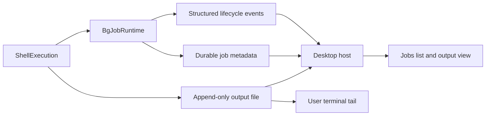

# Background job visibility and durable output

Date: 2026-09-11. Status: implemented in three stacked implementation PRs following merged plan #1465. Current validation is recorded in [Jobs UI PR #1469](https://github.com/moonbitlang/openseek/pull/1469); the original aggregate review evidence remains in [PR #1470](https://github.com/moonbitlang/openseek/pull/1470). The design and baseline findings below preserve the reviewed proposal; the final section records implementation decisions and evidence.

## Recommendation and scope

Extend the existing `ShellExecution` / `BgJobRuntime` architecture with guaranteed log files, durable job metadata, and a session-scoped Jobs panel. The file should be available as soon as a job is announced, and its absolute host path should be shown in the UI and in the tool handoff so the user can independently follow it.

The initial scope is every execution registered with `BgJobRuntime`, including an `mbtx` execution adopted after its foreground grace period. One job represents that execution, which can contain several subprocesses or a workflow. It does not automatically represent every subprocess inside a snippet, every provider request, or every internal async task. Existing workflow/subagent views remain useful; link them to their owning job where an explicit relationship exists. Instrumenting every nested subprocess is a separate extension.

Durable logs survive engine shutdown. Processes keep their current session-owned lifetime; this proposal does not turn them into services that survive application exit.

## Findings in the current implementation

| Area | Current behavior | Consequence |
| --- | --- | --- |
| `agent_tool/shell_exec/sink.mbt:121` | Memory-first sink creates a spill file only after the inline cap; seeds it with prior output. | A quiet or short job has no file to tail. The sink default is 12,000 characters, but `mbtx` passes 48,000. |
| `agent/tool_definition.mbt:69–90` | Creates `openseek-jobs-*` in a temporary directory; removes the directory after the session task group ends. Creation failure silently selects memory-only mode. | Logs cannot serve as durable user artifacts. Snippet scratch space and output retention currently share ownership. |
| `agent_tool/shell_exec/sink.mbt:128` | Swallows write failures and still advances `file_bytes`; read failures fall back to the head. | A log can be incomplete while reads look successful. This needs correction before advertising a reliable output file. |
| `agent_tool/bgjobs/bgjobs.mbt:230` | Detachable foreground executions use `fg-N.out`; adoption assigns a separate `bg-N` ID. Both counters restart with the runtime. | Never derive a log path from a displayed job ID, and never use that ID alone for historical identity. |
| `agent_tool/bgjobs/bgjobs.mbt:125` | Snapshots expose status, output size and watchdog flags, but not log path, cwd, timestamps or launch correlation. | There is no complete UI-facing job record. |
| `agent_tool/bgjobs/bgjobs.mbt:320` | Completion callback covers natural exits and watchdog kills, and intentionally omits requested stops. | The existing model notification hook is insufficient as a universal lifecycle event hook. |
| `protocol/event.mbt`, `protocol/command.mbt` | Completion is prose in `BackgroundNotice`; no structured job events, list command or controller stop command. | A UI would otherwise have to parse tool text or ask the model to poll. |
| `desktop/frontend/transcript/component/job_wait.mbt` | Extracts descriptions from tool briefs and renders waiting labels. | Helpful presentation, but not authoritative job tracking. |
| `cmd/openseek/serve.mbt:621` | Builds tools once, outside individual turns. | A job can remain alive after a turn finishes; job state must not be attached only to the active turn. |
| `desktop/internal/workflow/tail.mbt` | Already follows files using byte offsets and bounded reads. | Useful design precedent. Its newline-only delivery and silent read errors are unsuitable for a user log viewer without changes. |
| `desktop/internal/host/fs_ops.mbt:39` | Can read absolute host paths, but reads the whole file subject to the editor size cap. | Paths are supported; efficient incremental log reads are the missing API. |
| `desktop/frontend/right_panel/view.mbt:144` | Hosts a workflow panel alongside editor/browser surfaces. | Natural placement for a Jobs surface. |

The current limits are 20,000,000 retained characters per job and a 30-minute runtime deadline. Preserve them initially and display the reason when they stop a job. These are not byte limits, and the character count must not be used as a file cursor.

## User experience

Provide a persistent `Jobs · 2 running` entry in the conversation UI that opens a Jobs tab in the right-hand panel. Show running jobs first, then recent terminal jobs; retain history on reopening the conversation.

Each row shows description (falling back to the execution label), job ID, state, elapsed time, and last-output age. Details show cwd, start/end time, exit code or stop reason, output size, log health, and the absolute log path. Use an activity indicator while running, not an invented percentage. Silence means “no output for …”, not “hung”.

Actions: View output, Copy path, Copy tail command, and Stop once the controller command is implemented. Show the execution host for remote sessions; a remote path cannot be tailed directly on the browser's machine. Provide POSIX `tail -n 200 -f '…'` and Windows `Get-Content -LiteralPath '…' -Tail 200 -Wait` using platform-appropriate quoting.

The output view starts with a bounded recent window, follows new output, and pauses autoscroll when the user scrolls upward. Provide Resume following and Load earlier. Render output as text; do not interpret it as Markdown or HTML. Preserve partial lines and handle UTF-8 boundaries. Keep memory bounded even when a user leaves a noisy job open.

Small logs may also open in the ordinary file editor. The live output view should use incremental reads rather than repeatedly reloading the whole editor document. A read-only Viewer integration is optional; if shared editor functionality is needed, build and preview it through `editor/internal/shell` and include its `desktop/frontend/fileeditor` adaptation in the same change.

## Storage and output contract

Use the existing session store and introduce this proposed layout:

```text
<store>/sessions/<session-id>/jobs/<runtime-generation>/
  bg-1.json
  fg-1.out
  bg-2.json
  fg-3.out
```

Keep the existing foreground execution filename where convenient; each job record explicitly names its output file. Do not rename an open log during adoption. Allocate a collision-resistant runtime generation using exclusive creation so restarting a session cannot overwrite old logs.

Store artifact references relative to the session directory. Resolve the current absolute path when serving a request, because Desktop archive/unarchive moves the session directory. Logs then move and delete with their session. An already copied absolute path can change on archive; refresh it in the UI. Add a session-store artifact-path API rather than duplicating private path construction across packages.

Separate persistent logs from temporary snippet/build directories in `build_tools`. Pass the log-store context explicitly from both `cmd/openseek/main.mbt` and `serve.mbt`; cover the default `agent.run` construction path as well. A no-session run can use an explicit temporary log directory, with that lifetime reported. Memory-only retention remains an explicit mode for tests/embedders, not a silent production fallback.

Keep small foreground executions in memory. At background adoption, serialize against the pipe reader, create the log even when empty, seed it with all buffered output, then announce the background job. Subsequent output appends to the same file. Reuse an already-open spill file without renaming it. Adoption becomes async so the handoff cannot return a path before its creation/seed succeeds. Explicit background starts establish the file before returning their job ID. A foreground execution that never becomes a job retains its existing discard behavior.

Initial file creation failure should fail background adoption visibly and stop the execution; it must not leave an unregistered process running. A midstream log-write failure should mark logging failed, preserve the last known committed position, and request termination of the tracked execution so it cannot continue producing output that nobody can inspect. Report that failure through the engine event/tool channel even if metadata persistence also fails. Never advance the committed byte count after a failed write; inspect actual file length when partial writes are possible. Missing files and I/O errors are separate outcomes.

Keep the present merged stdout/stderr UTF-8 text semantics for the first version. Invalid input is decoded lossily and must be flagged; this is a readable output log, not a byte-perfect recording or separate stream capture. A job file also cannot reveal data buffered inside a child process or a snippet using `Cmd.output()` until that code emits it. Streaming helpers such as the existing `each_line` workflow snippets help, but they too wait for complete lines. Build diagnostics collected before execution currently travel separately as `build_notes`; label the file as execution output, and link build diagnostics separately if desired.

Append without per-chunk `fsync`; ordinary successful writes make output visible to external readers. Crash durability is a different guarantee. Close descriptors after terminal draining and reopen logs by path for subsequent reads, preserving `job_output` access. Keep existing output/deadline limits. Initially retain adopted logs until explicit session deletion; expose total retained bytes and avoid automatic deletion of active logs. Age/quota cleanup can follow with an explicit policy. Even without a per-session quota, disk failures must be handled as above.

## Job model and lifecycle

Persistent identity is `(store, session, runtime_generation, job_id)`; add the host/channel when routing in Desktop. The friendly ID can remain `bg-1` within its runtime.

The proposed typed record contains:

- Identity and schema version; monotonic record revision.
- Execution label, optional description, cwd, optional originating tool-call ID and parent workflow reference. Pass tool-call correlation from dispatch if needed; never reconstruct it by matching output prose.
- Start timestamp, optional backgrounded/end timestamps, and elapsed duration. Use epoch timestamps for history and a monotonic clock for live elapsed time/deadlines.
- `Running`, `Stopping`, `Exited(code)`, `Stopped(reason)`, or `Interrupted(owner_lost)` state. Reasons distinguish user stop, teardown, output limit, time limit, and execution/logging failure.
- Output artifact reference, observed/committed byte counts with clear definitions, and explicit log health such as `Available`, `Failed(error, committed_bytes)`, or `Unavailable(reason)`. An empty existing file is valid output.

Write each metadata snapshot atomically via temporary file plus rename. Persist on registration and lifecycle changes, not every output chunk. The log is append-only; live size can be read from it. Emit a structured `JobUpdated` event after a successful metadata commit. If persistence fails, retain the in-memory record and emit a visible persistence-error event; do not claim durable success. Host list replies reconcile disk records with authoritative live snapshots.

Keep the existing `on_job_exit` model-notice behavior separate from the new lifecycle observer. The new observer covers registration, stop request, natural completion, watchdog termination, and teardown. Preserve the runtime's existing ordering: final output draining and launcher cleanup/completion bookkeeping must not be bypassed by UI updates.

Turn completion does not terminate or hide a job. Session shutdown does terminate tracked processes and records terminal status under cancellation protection. An abrupt engine death can leave only a persisted Running record: after the host verifies that that runtime owner is gone, project it as Interrupted with an unknown final outcome. A disconnected browser alone is not evidence of process death. Reconnection to a live host reloads actual status. Do not reattach or kill a process based solely on a stale PID.

Current cancellation reaches only the direct child; descendants can survive. The UI must describe the tracked execution's outcome without claiming the entire process tree is dead. Strong process-tree cleanup would require a separately validated cross-platform process-layer change and is not a prerequisite for visibility.

## Engine, host and frontend integration



Add shared protocol events and explicit codecs, updating `protocol/event.mbt`, `parse.mbt`, and `to_json.mbt`, then their desktop projections. Update exhaustive consumers, including CLI/TUI/session viewer where applicable. Desktop host and frontend ship together; no old-host compatibility layer is required.

Proposed Desktop operations:

- `jobs.list(session identity)`: historical records plus reconciled live status. Support pagination when history grows.
- `jobs.read(job identity, cursor?, max_bytes)`: bounded initial tail or incremental output. Return actual start/end offsets, a next cursor, more-data indication, current status, and typed missing/failed results. Cursor identifies the artifact generation as well as the byte offset. Decode complete UTF-8 sequences without dropping trailing partial characters. A reset/replacement invalidates the old cursor explicitly.
- `jobs.stop(job identity, request_id)`: addressed to the owning live engine, with typed stopped/already-terminal/not-found/owner-unavailable outcomes. Handle outside the model turn so it works while the agent waits or is idle. Do not launch an LLM turn or simulate a `job_stop` tool call.

The engine also needs a controller snapshot request for live reconciliation and a stop command/response in `protocol/command.mbt` and the serialized serve command loop. Keep stopping asynchronous relative to command intake; emit its final result when the tracked execution settles. Validate runtime generation so a stale stop cannot target a new `bg-1`.

Route job events by session and generation independently of `active_run_id`; `desktop/frontend/update.mbt` currently drops most events that cannot match an active run. On initial load/reconnect, merge the snapshot with incoming events by identity and revision, so a late snapshot cannot roll back an exit. Persisted metadata is the recovery source, not previous transcript briefs.

Begin with bounded request polling for the visible output view, roughly every 500 ms, one request in flight, and no hidden-view polling. Cap a read at about 64 KiB and the rendered buffer at about 1 MiB; confirm these defaults with measurements. Supply a continuation for bursts and a final drain after terminal status. Network slowness must never backpressure the execution's pipe reader. A later push subscription can preserve the same cursor contract if polling proves insufficient.

## Delivery sequence and acceptance gates

| Phase | Changes | Evidence required before proceeding |
| --- | --- | --- |
| 1. Reliable files | Sink write/error semantics, guaranteed logs at background adoption, separate scratch/log ownership, generation directories, paths in `mbtx` handoff / `job_output`. | A quiet job immediately has an empty file; external tail sees small output and output without newline; adoption preserves pre-detach output and path; a completed adopted log remains after shutdown. |
| 2. Durable lifecycle | Metadata, universal lifecycle observer, timestamps, session artifact API, structured events and live snapshot command. | Natural exit, stop, watchdog and shutdown each settle once; restart cannot overwrite or collide; lost ownership and persistence failure are visible; archive/unarchive resolves paths. |
| 3. Host reads and recovery | `jobs.list` / `jobs.read`, bounded byte cursors, session routing and reconnect reconciliation. | Reads do not duplicate/skip data across UTF-8 boundaries; simultaneous sessions/hosts with `bg-1` stay separate; stale snapshots/events cannot resurrect terminal jobs; I/O failure differs from no new output. |
| 4. Jobs UI | Panel, running count, row/details, Follow/Pause/Reload tail, older-job pagination, copy path/tail command. | Browser coverage for empty/noisy/failed jobs, autoscroll behavior, remote paths, background tabs, reconnect and bounded buffers. |
| 5. Direct controls and hardening | Host-to-engine stop, idempotent results, teardown barriers, history/resource limits. | Stop works during an active turn and while idle; stale generations are refused; stop/exit races preserve the outcome; engine loss does not claim descendants were killed. |

Phase 1 is independently useful: the user can manually tail output before the UI lands. Phases 1–4 deliver the requested visibility. Phase 5 adds a useful control and completes the lifecycle hardening before presenting Stop in the product.

Use focused sink/runtime tests and extend the offline real-engine fixture in `tests/integration/turn_finish.mbtx`; gated child output can prove intermediate visibility without flaky sleep-based expectations. Inject file open/write failures and verify final output is drained before terminal reads claim completion. Exercise Unicode, invalid UTF-8, huge lines, output/deadline limits, and no-session mode. Benchmark concurrent noisy jobs and a burst of tiny foreground executions to verify they create no unnecessary files and check descriptor cleanup.

For implementation, finish with `moon info && moon fmt` and review generated interfaces; run `just check`, `just test`, `just build`, and `just desktop-test-browser`. If shared editor code changes, also run `just editor-test` and `just editor-test-browser`. The original planning-only PR required no runtime tests; implementation evidence is recorded below.

## Difficulty and remaining implementation decisions

Overall: medium-to-high engineering effort, with the lifecycle/storage work carrying more risk than rendering. The existing execution/sink layering makes this an extension rather than a new scheduler.

Highest-risk areas are cancellation-safe finalization, honest write-failure reporting, restart/reconnect identity, and the distinction between a turn finishing and the engine stopping. Medium-risk areas are byte-cursor correctness, remote routing, archive moves, disk growth and frontend backpressure. The basic job list and copy-path controls are comparatively small.

Before coding phase 1, settle the exact sink retention enum and public artifact-store API against MoonBit's local filesystem/process APIs. Before phase 2, settle a serial lifecycle publication path that preserves the current cleanup/completion ordering, and define how an engine owner is verified after host restart. Before phase 4, choose a dedicated lightweight log view or the public read-only Viewer based on a bounded-output prototype. These choices do not change the storage, identity or recovery contracts above.


## Reviewed stack and completion checklist

The user authorized the complete implementation through stacked PRs and independent `openseek review`, followed by a review of the full stack. Each branch is based on the previous branch; each PR targets that predecessor so its diff remains focused. Do not merge a partial stack during implementation.

The plan (#1465) is merged. The implementation is reorganized into three independently buildable PRs, with each review fix included in the layer it corrects:

1. `codex/bg-jobs-logs` → main (#1466): retained logs, durable lifecycle records and events, snapshot/stop controls, lazy storage preparation, teardown/restart identity, and real CLI regression coverage. Includes the two Desktop exhaustive-match adaptations required by the new wire variants.
2. `codex/bg-jobs-host` → logs (#1468): scoped list/read/stop bridge, bounded cursors and history, ownership recovery and storage-error handling, plus Windows host verification.
3. `codex/bg-jobs-ui` → host (#1469): Jobs panel, bounded Unicode-safe output, lifecycle/history refresh, and browser E2E.

The former lifecycle PR (#1467) is absorbed into #1466. The former hardening PR (#1470) is distributed across all three layers; its review history remains available. Regrouping preserves the final implementation and all regression tests while retaining newer main changes.

Run `openseek review --base <predecessor>` on each implementation slice; fix actionable findings and re-review changed slices. At the end run it against the original stack base, inspecting the complete feature and cross-layer contracts. Review reports and test evidence belong in the PR descriptions. A plan review is design feedback, not evidence that implementation works.

Completion means the three implementation PRs are ready, implemented behavior passes the specified gates, independent review findings are resolved or explicitly accounted for, and a final aggregate review has run. Retention/owner verification/byte-cursor behavior are part of the implementation, not deferred placeholders. Optional nested subprocess instrumentation and push subscriptions remain out of scope.

Plan review completed with `openseek review --base 08739cc19a6ebefa273fea4210613d98216bb51c`: no blocking/design findings, three citation-precision comments fixed. Reviewer reported `moon check --target all` and `moon test` passing (wasm 99, JS 1907, native 1784 tests). References in the findings table describe the original base revision.


## Implementation decisions and evidence

The current implementation stack is [runtime #1466](https://github.com/moonbitlang/openseek/pull/1466) → [host #1468](https://github.com/moonbitlang/openseek/pull/1468) → [UI #1469](https://github.com/moonbitlang/openseek/pull/1469), following merged [plan #1465](https://github.com/moonbitlang/openseek/pull/1465). The original lifecycle and hardening PRs remain as historical review records.

- `SessionStore::job_logs_dir` validates a prospective path without creating a session. The runtime prepares its canonical generation directory and exclusive owner lock on first retained execution, after the turn's first durable append. Tiny foreground output still allocates no output file. Background adoption creates/seeds the file under the sink mutex before publication.
- `JobRecord` uses a relative output basename, a generation, a positive revision, explicit optional timestamps/errors, and `Running/Stopping/Exited/Stopped/Interrupted` state. `job_changed` carries `started/updated/finished/failed`; separate `jobs_snapshot` and `job_stop_result` messages support correlated host requests outside turns. Startup publication completes before live snapshots expose the new record. Metadata persistence failures remain explicit in live records.
- An exclusive `owner.lock` lives until child joining and terminal metadata finalization finish. Historical running records become Interrupted only after the host acquires that lock; an unavailable lock or owner-check failure is not treated as a dead process. Metadata/output references survive archive moves because the host resolves paths from the current session placement.
- Metadata history is ordered by stable runtime creation stamps and monotonic UUIDv7 IDs (legacy `bg-N` records remain readable). The host enumerates names and decodes at most 100 requested records per page plus the selected record, instead of replaying every historical record each second. Corrupt entries are reported in the page that contains them. The live runtime snapshot is overlaid by full generation/id identity. A selected record outside the first page is refreshed independently, including while output following is paused. Page merges update existing rows instead of preserving stale states.
- Output reads return at most 64 KiB with absolute byte cursors and complete UTF-8 boundaries. Truncation, missing files, and I/O errors are explicit failures. Managed restarts always allocate a new generation. Arbitrary external replacement of a log at the same path with equal-or-larger content is outside this cursor contract; there is no portable inode-based replacement detector in this change.
- The initial UI uses chronological history with the active count inside the Jobs panel. Earlier output is available through the retained file and copied tail command; in-panel output starts at a bounded tail, with Reload tail and older-job pagination rather than an unbounded log browser. The Jobs tab uses the existing dock and a dedicated plain-text view. It polls while visible at one-second intervals, with one list and one selected-log read in flight. The display keeps at most 262,144 UTF-16 units and preserves surrogate boundaries; the complete retained log remains on disk. Pause stops display reads, manual scroll pauses following, and Reload tail returns to recent output. Copy path and shell-quoted tail commands work for POSIX and Windows host paths. Hidden panels stop polling, and channel/session/visibility epochs reject late replies.
- Epoch timestamps are used for history and displayed elapsed time, clamped against backward clock changes. The existing execution watchdog remains based on the async library's epoch clock; this change does not introduce a new portable monotonic clock implementation. It also does not promise per-chunk fsync or process-tree termination.

The log-slice review reported one medium, two low, and one wording finding. The runtime layer addresses the medium by delaying artifact-directory creation rather than hiding damaged sessions from listings; adds an actionable scratch-directory error without silent memory-only fallback; catches terminal diagnostic read errors; and restricts temporary-file wording to actual files.

Browser evidence before final hardening: four Jobs scenarios passed against the production bundle with a real subprocess and retained files behind the test transport. They cover stdout/stderr, UTF-8, no-newline output, pause/resume, manual scrolling, clipboard, stop, stale reads, missing files, session switching and page reload. Light/dark/narrow screenshots were inspected; narrow command clipping was fixed. The complete existing Desktop Chromium suite passed 82 tests. Native host tests independently exercise the actual byte reader, owner checks, metadata decoding and page limits. The original final gate results, complete-stack review, and correction reviews are recorded in [PR #1470](https://github.com/moonbitlang/openseek/pull/1470).

The hardening validation additionally covers a selected job beyond the first 100 history rows, 20 concurrent tiny foreground executions with no output files, eight concurrent 256 KiB output jobs, malformed UTF-8 cursors, and controller snapshots during an active model request. The real CLI fixture checks that the file exists with pre-adoption output before the start event, rejects stale generations, stops while idle, and retains identical output and terminal metadata after restart.


The lifecycle review's immutable-revision finding is fixed: publication snapshots once, then uses that same value for the metadata and event (adding an explicit persistence error if needed). The host review's Windows separator issue is fixed with shared normalized ownership paths, including live metadata fallback; UTF-8 leading-byte skipping is restricted to a genuine mid-file tail. Windows CI runs the host job path/read tests. The UI review's surrogate-boundary issue has a regression test, and Jobs has its own launcher icon. UNC paths use the PowerShell tail command after host normalization. The original shared `/tmp/bg-1.out` test collision was removed by giving each test its own directory.


### Follow-up review hardening

The follow-up to Claude's review keeps the same runtime/host/UI boundaries. Runtime teardown removes a generation only when it adopted no jobs and contains only its owner lock; missing metadata never justifies deleting a retained log. Full-log reads snapshot the committed prefix under the sink mutex, then read outside it. A failed initial seed preserves the captured memory head and the partial file path for diagnosis.

The host consumes correlated snapshot/stop replies without broadcasting them as conversation events. Stop has separate delivery (5 seconds) and settlement (30 seconds) budgets; a settlement timeout says completion is unconfirmed and never reports a merely requested stop as completed. Failed live refreshes report uncertain ownership while keeping controls conservative. Historical metadata byte counts remain unsuitable as a cap for actively growing log reads because metadata is published on lifecycle changes, not on every append.

Following can drain up to four 64 KiB pages per refresh cycle, with a catching-up indicator and a progress check that defers incomplete UTF-8 suffixes to the next tick. Pause/resume and manual reload keep an outstanding selected-log read accounted for; a queued reload discards the obsolete reply before issuing a fresh tail read. Stop is available independently of the output path. Common stop reasons have readable labels. The additional browser scenarios cover a large completed burst, paused reload with a delayed response, and stopping a controllable job without a log path. Current test counts and fresh independent review results are maintained in #1469.
