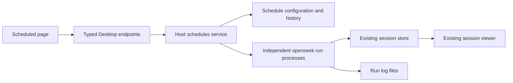

# Local scheduled tasks

Date: 2026-09-13. Implemented scope: a lightweight Desktop host timer that
launches independent `openseek run` processes. This replaces the earlier
proposal for scheduled continuation of existing conversations.

## Behavior

- Create or edit a named task with an automatically created working directory (default)
  or an attached project, with a one-time delay
  or a fixed interval in minutes. An optional model overrides the host default.
- The primary host runs the timer for its application lifetime. Closing or
  refreshing a client page does not stop it. Exiting the host stops scheduling.
- Different plans can run concurrently, up to four CLI processes. The same
  plan cannot overlap itself. Periodic occurrences at capacity are skipped;
  explicit Run now requests wait for capacity.
- Missed times are not replayed. Startup advances expired intervals to their
  next future time and disables expired one-time plans. A tick more than a
  minute late is skipped, covering sleep/wake gaps.
- Save and run now atomically saves the plan and queues an extra immediate run.
  It keeps the scheduled deadline; saving alone does not execute.
- Run now preserves the plan's enabled state and future deadline. Pause stops
  future and queued launches; Stop run cancels the current process. A running
  plan must be stopped before it can be deleted. History is retained.
- Automatic folders live at `~/OpenSeek/Scheduled/<plan-id>`.
  The host creates and indexes the plain folder before the first CLI launch,
  without Git/worktree requirements; later
  runs reuse it and retain progress files. Deleting a plan retains its folder.
- Each run gets its own session. It runs in the selected project directory;
  independent sessions do not isolate changes to the same files.
- The host applies the existing provider/credential/toolchain configuration.
  CLI arguments are passed as an argument array, with the task after `--`.
  Credentials are passed through the existing environment builder, not stored
  in plans. Unattended runs use `--approval=never`, refusing escalation.
- Every run has a user-visible timeout (1–1440 minutes) and a 1000-step limit.
  Startup diagnostics also go into the log. Stdout/stderr redirect to a durable log file, so output cannot fill a pipe
  or accumulate unbounded host memory.
- A zero exit code is checked against the session's durable terminal: setup
  failures and max-step exhaustion must not appear as successful work.
- The Scheduled page shows lightweight running status and stop controls.
  Open session reuses the existing transcript viewer during and after a run.
  The host follower tails durable CLI events; an operation lease prevents a
  second writer or archive from racing the CLI. The composer is read-only
  while a scheduled run is active; host status refresh restores it on completion.
  View log also works for failures before a session was created. Large logs
  use the existing file-read size limit and remain available at their path.
- CLI sessions become visible once their durable record exists.
  Completion publishes a session-change notification to refresh clients.

## Architecture

The host service lives in `desktop/internal/engine/schedules.mbt`, beside the
existing run configuration and process environment helpers. It does not add
scheduling, deduplication, or a new execution protocol to the core agent/CLI.
The primary host starts it from `desktop/main.mbt`; `internal/api` exposes
`schedules.list`, `schedules.save`, and `schedules.action`. Explicit protocol
codecs reject malformed configuration and unknown timing/status variants.

State lives in `<host-runtime>/schedules/schedules.json`, with a schema version.
A mutex serializes modifications. A temporary file is synced and renamed
before publishing the new in-memory state. Corrupt or unreadable state is an
error, never an empty plan list. Running records are persisted before process
launch and settled after process exit. Startup marks leftover Running records
Interrupted without retrying them; there is no exactly-once or automatic
recovery promise. A failed result save retries the save, not the task.

Directory registration broadcasts before the CLI follower starts, so clients
can place its commits. Opening a scheduled session also reconciles its directory
and requests placement metadata if a prior notification was missed. Run start
and settlement notifications refresh the visible schedule page.

Clients also poll every two seconds only while the Scheduled page is visible,
with one request in flight. Replies retain their device and request sequence.
Saved plans outlive the page, and UI state does not drive the timer.

## Deliberate limits

No continuation of existing sessions, automatic worktrees, daily timezone
rules, catch-up queue, automatic task retries, standalone daemon, cloud
execution, or scheduling of Codex backend tasks. Each scheduled run uses the
OpenSeek CLI. The application must be running and the selected project must
remain attached and accessible. History and logs persist until manually
managed; automated retention is future work.

## Validation

Native tests cover restart recovery, missed deadlines, four-process admission,
no overlap, Run now preserving paused/periodic plans, corrupt-state refusal,
CLI argument/log handling, cancellation, and timeout. Protocol tests cover
malformed timing and optional fields. Browser tests exercise create/edit,
failed-save draft retention, pause/run/stop, completed-session navigation and
mobile layout. Repository gates: `just check`, `just test`, `just build`.
