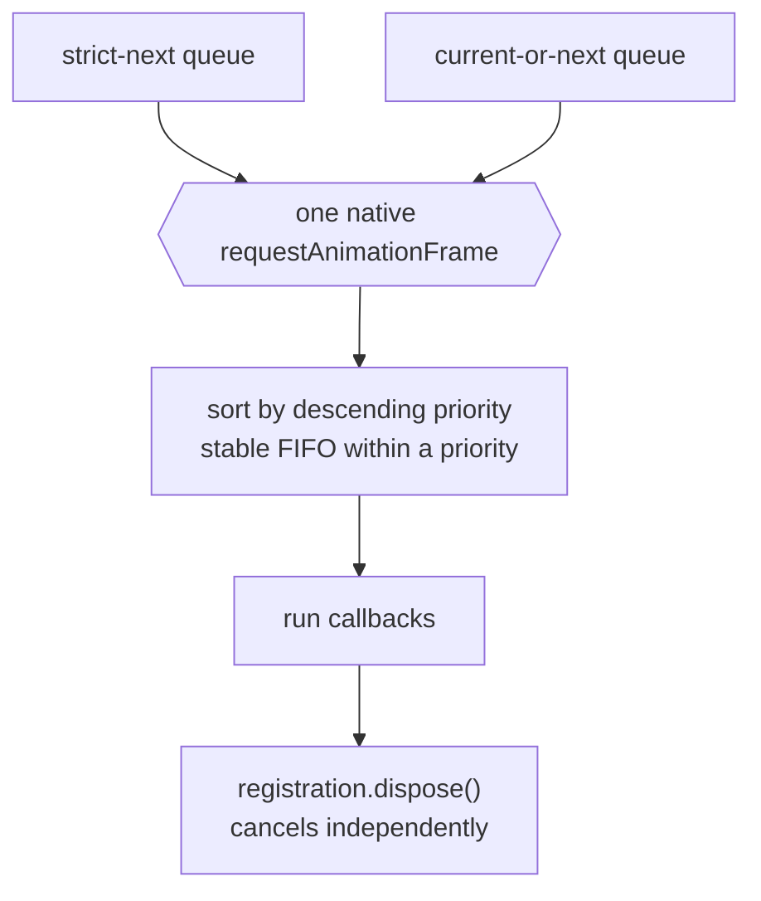

# base/browser

The canonical browser runtime and DOM primitives shared by every js-only viewer
package. It is the bottom of the browser half of the dependency graph: it may
depend on `base/common` and Rabbita's DOM bindings, and nothing above it may
reach the browser except through here.

> The code blocks on this page are `mbt nocheck`. This package is js-only and
> every value it owns needs a live DOM or a real `requestAnimationFrame`, which
> `moon test` (Node, no DOM) cannot provide. Its executable coverage is the
> `*_wbtest.mbt` suites in this directory, which install a fake browser runtime,
> plus the Playwright suites under `tests/browser/`.

## What it owns

```d2
direction: right

bb: base/browser {
  grid-columns: 1
  dom: DOM primitives (untransformed clientWidth/Height)
  mouse: mouse events
  ptr: global pointer-move monitor
  raf: animation-frame coordinator
  ro: ResizeObserver binding
}
up: js-only viewer packages {
  grid-columns: 1
  view: internal/viewer/browser/view
  ctrl: internal/viewer/browser/controller
  sb: internal/viewer/ui/scrollbar
  root: root viewer
}

up -> bb: the only browser door
bb -> up: "never imports upward" {style.stroke: red; style.stroke-dash: 3}
```

Reads are deliberately *untransformed*: `clientWidth`/`clientHeight` are taken
straight from the element, because a CSS transform on an ancestor must not
silently rescale the editor's own layout arithmetic.

## The one animation-frame coordinator

There is exactly one frame coordinator per JavaScript realm. Monaco's explicit
per-window maps and its cross-editor phased prepare/render batching are not
local contracts — the product is single-realm, so one coordinator is the whole
story.



Both queues share that single native callback, sort by descending priority with
stable FIFO ties, and return independently cancellable registrations.

```mbt nocheck
// Run on the *next* frame, never the one currently being serviced.
let pending = @base_browser.schedule_at_next_animation_frame(priority=1, () => {
  render_pass()
})

// Run in the current frame if one is already being serviced, otherwise the next.
@base_browser.run_at_this_or_scheduled_animation_frame(priority=0, () => {
  measure_pass()
})
|> ignore

// Cancelling one registration leaves every other queued callback intact.
pending.dispose()
```

Common ViewModel/layout code stays browser-free and receives scheduling only
through root injection: `viewer/common/**` never imports this package, and this
package never imports upward into viewer packages.

## Pointer monitoring

A drag gesture must keep receiving move events after the pointer leaves the
element it started on. The global pointer-move monitor owns that: it captures at
the document level for the duration of the gesture and releases on stop.

```mbt nocheck
let monitor = @base_browser.GlobalPointerMoveMonitor::GlobalPointerMoveMonitor()
monitor.start_monitoring(
  initial_element,
  pointer_id,
  initial_buttons,
  event => update_selection(event),
  () => finish_selection(),
)
// ... later, or automatically when the pointer is released:
monitor.stop_monitoring(true)
```

## Boundaries and checks

This package must not import product, viewer, server, workspace, or host-effect
packages. Viewer packages may use `rabbita/dom` and `rabbita/js`, not Rabbita's
TEA framework packages. The complete API is `pkg.generated.mbti`.

```sh
moon test --target js base/browser
just test-browser-smoke
```

## Browser storage and URLs

`local_storage_get`, `local_storage_set`, and `local_storage_remove` share a
small typed binding. Reads distinguish an absent key from an empty value;
`StorageFailure` distinguishes unavailable storage from an access failure.
Callers own fallback and reporting policy. No JavaScript error type escapes
these APIs. `resolve_url` likewise returns a normalized URL and protocol or
a diagnostic from the browser parser.
