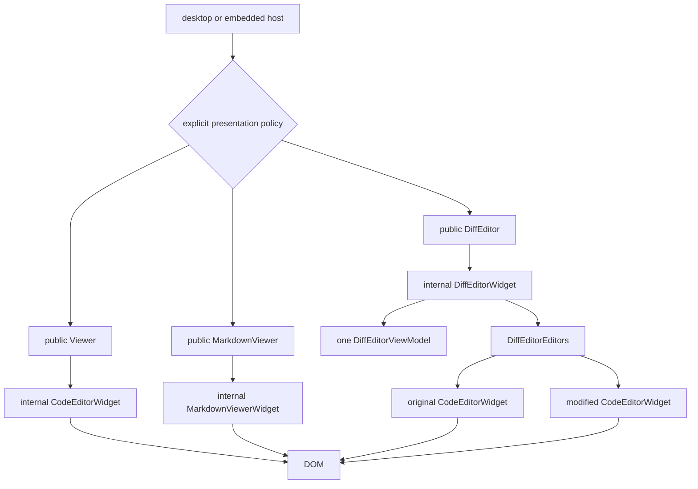

# Architecture

This editor source contains a reusable MoonBit readonly viewer and an
editor-owned reference host/backend:

- `viewer` is the js-only public editor facade and browser surface.
- `internal/shell` is the demo, development, and end-to-end host. It is not an
  external import surface.
- OpenSeek's `desktop/frontend/fileeditor` is the primary downstream,
  user-facing host in the surrounding monorepo. It consumes the public Viewer
  surface and owns its product-specific composition.

For exact APIs use the owning package's `pkg.generated.mbti`; for exact
dependencies use `moon.pkg`.

Monaco/VS Code is the primary behavioral reference and a source of tested
algorithmic and ownership patterns. It is not a required type, class, package,
or inheritance template: local representation follows MoonBit capabilities,
lifetime boundaries, and dependency direction. CodeMirror is secondary.
`vscode/` and `codemirror/` are pinned research trees only; product code never
imports them and public names remain MoonBit-owned.

## Runtime Shape



The public root is a façade, not the editor implementation. `Viewer` is an
opaque wrapper around exactly one code-only `CodeEditorWidget` in
`internal/viewer/code_editor_widget`. That kernel owns configuration, one model
slot, `ViewModel`, `View`, input, render scheduling, decorations, ViewZones,
scroll/focus state, and code contributions. It neither imports the public root
package nor knows about Markdown or diff presentation policy.

`MarkdownViewer` wraps `internal/viewer/markdown_viewer.MarkdownViewerWidget`.
It directly owns `MarkdownDocumentView` and its Markdown-specific hover,
definition, folding, projection, and native scroll lifetimes. The host supplies
`OrdinaryMarkdown` or `MoonBitMarkdown` explicitly; the widget never infers a
presentation from URI or language id.

`DiffEditor` wraps `internal/viewer/diff_editor.DiffEditorWidget`. The internal
widget owns exactly two `CodeEditorWidget` kernels through `DiffEditorEditors`
and exactly one shared `DiffEditorViewModel`. It never constructs, contains, or
calls the public `Viewer`. Diff panes therefore show source code for every
resource, including Markdown, without a force-code escape hatch.

Every kernel construction supplies an explicit
`CodeEditorContributionDescriptors` set; there is no editor-role field or
role-based feature branch. Public `Viewer` selects `standalone`, both diff
panes select `diff_pane`, and an embedded Peek source preview selects
`peek_preview`. Standalone enables the complete code contribution set. Diff
panes retain agent feedback, folding, hover, context menu, Definition, and
References, but omit Markdown-comment rich replacement to preserve source-line
geometry and omit quick diff to prevent a nested diff. Peek previews retain
hover, context menu, and direct Definition only, so they cannot recursively
open References Peek, render Markdown comments, or attach quick diff. Runtime
availability is always determined by whether the corresponding typed
contribution was instantiated.

Presentation selection belongs to desktop and embedded hosts. The usual policy
is a decoded lowercase `.md` path or exact `markdown` language id for
`MarkdownViewer`, with `.mbt.md` selecting `MoonBitMarkdown`; all other files
use `Viewer`. A comparison always uses `DiffEditor`.

Each surface borrows caller-owned models and an explicitly supplied service
bundle. Its mounted constructor owns the renderer subtree and scheduled work,
not the host element. Clearing or replacing a model detaches it synchronously;
Markdown and diff setters return their fully detached old model value so the
host can release it immediately. Disposal is idempotent and never disposes
caller-owned models, hosts, or services.

The host owns files, transport, persistence, reload policy, shell chrome, and
error presentation. The viewer owns readonly rendering, selection, scrolling,
widgets, language-feature presentation, and editor events.

`ViewerServices(resource_path_label=...)` lets each host supply workspace-relative
paths for Code and Markdown Peek labels. It returns `None` for resources without
a host label; resource identity, model resolution, and navigation still use the
original URI. Workspace membership and the current root remain host policy.

## Package Tiers

Dependencies point strictly downward through the tiers; no lower tier imports
an upper one:

```d2
direction: right

product_host: OpenSeek desktop file editor
reference_host: editor reference composition {
  grid-columns: 1
  workbench: internal/shell/workbench
  backend: moonbitlang/editor-server
}
facade: viewer facade
inner: internal/viewer {
  grid-columns: 1
  code_editor: code_editor_widget
  diff_editor: diff_editor
  markdown_viewer: markdown_viewer
  view: browser/view
  contrib: contrib/*
  markdown: markdown
}
common: viewer/common {
  grid-columns: 1
  model: model
  view_model: view_model
  view_layout: view_layout
}
foundations: shared foundations {
  grid-columns: 1
  base: base/*
  language: language
  syntax: syntax
  log: platform/log
}

product_host -> facade
reference_host -> facade
facade -> inner
inner -> common
common -> foundations
```

### Shared foundations

- `base/common`: URI/path, positions/ranges, events, and disposables.
- `base/browser`: canonical browser runtime and DOM primitives (including
  untransformed `clientWidth`/`clientHeight` reads), mouse events, global
  pointer-move monitoring, and the one realm-global animation-frame
  coordinator. Its strict-next and current-or-next queues share one native rAF,
  sort by descending priority with stable FIFO ties, and return independently
  cancellable registrations.
- `language`: backend-neutral diagnostic, hover, location, and symbol provider
  contracts.
- `syntax` and `syntax/lang_*`: stateful line-tokenization contracts and
  concrete compile-time lexers. `syntax/examples/*` contains opt-in reference
  implementations for examples and test-mode consumers.
- `platform/log`: host-neutral logging.

### Viewer common tier

`viewer/common/**` is DOM-free and multi-target:

- `model`: immutable text snapshots, model identity, decorations, and the
  complete model-owned tokenization cluster. Its shared live model state,
  stores, queues, backends, attached-view aggregation, and scheduling machinery
  are package-private.
- `services` and `tokens`: language-id encoding and compact line tokens.
- `editor_api`: the single owner of public cursor/model/scroll event values and
  editor-option enums shared by root, cursor, layout, view-model, and browser
  consumers.
- `agent_feedback_api`, `navigation_api`, and `quick_diff_api`: host-facing
  DTO/callback handles. Navigation exposes only location-opening intent and
  caller-owned target-model leases. Current/Side opening, resource loading, and
  model lifetime remain host policy; concrete feature implementations remain
  contributions below their callers.
- `languages` and `markers`: runtime provider registration and
  diagnostics-to-decoration flow. Definition and References providers share
  selector scoring, newer-first ties, ordered aggregation, failure isolation,
  and cancellation. Their opaque `LanguageHandle`,
  `MarkerServiceHandle`, and `MarkerDecorationsHandle` expose only the reviewed
  Viewer capability floor while hosts retain the concrete registries/stores.
  The marker-decoration handle can resolve the live, exact-model occurrences
  used by browser presentations; Markdown does not create a second marker
  store or decorate a synthetic model.
- `core`, `cursor`, `config`: coordinates, selection/cursor state, and editor
  configuration values.
- `view_model`: injected text, wrapping/folding projection, model/view
  conversion, and concrete inline/model decoration resolution.
- `view_layout`: scrolling, viewport, zones, and view-line rendering data.
- `diff`: line diff contracts used by quick diff.
- the root `viewer/common` package is a small compatibility surface for line
  HTML helpers.

Common code never imports browser or contribution packages.

The animation-frame coordinator is one process value for the supported
single-JavaScript-realm product. Monaco's explicit per-window maps and its
cross-editor phased prepare/render batching are not local contracts. Common
ViewModel/layout code stays browser-free and receives scheduling only through
root injection; `base/browser` never imports upward into Viewer packages.

### Viewer browser tier

The root `viewer` facade and public `viewer/browser` contract package are
js-only. Concrete browser runtime packages live below the module-private
`internal/viewer/**` boundary:

- `viewer` is the opaque public façade for `Viewer`, `MarkdownViewer`, and
  `DiffEditor`. Public `Viewer` construction is only `Viewer::create`;
  precomputed reference locations enter only through
  `Viewer::show_references`, while the provider-backed References contribution
  consumes only the opaque `LanguageHandle`; `ViewerOptions`,
  `ViewerServices`, and `ViewerViewState` expose no public layout. Root
  generated interfaces may reference language/common values, browser
  contracts, and common capability handles, never private view or contribution
  implementations.
- `internal/viewer/code_editor_widget` is the canonical Monaco
  `CodeEditorWidget`-shaped implementation. Public `Viewer` owns one kernel and
  forwards the standalone code API. The internal package cannot import public
  `viewer`, `diff_editor`, or Markdown document packages, and it exports only
  stable coordinator primitives rather than raw configuration, `ViewModel`,
  `View`, or `MouseHandler` handles.
- `internal/viewer/diff_editor` owns `DiffEditorWidget`,
  `DiffEditorEditors`, one shared `DiffEditorViewModel`, diff decorations,
  managed alignment zones, stable scroll restoration, overview, layout, and
  navigation. `DiffEditorEditors` creates two code kernels directly; there is
  no public `Viewer` in this ownership graph. The public layouts are
  `SideBySide` and `Inline`; no compatibility renderer or adapter layer is
  retained.
- `internal/viewer/markdown_viewer` owns the standalone rich Markdown widget
  and its model-scoped feature bridges. Public `MarkdownViewer` projects a
  shared `ViewerServices` bundle into its narrower service contract and keeps
  Markdown model/options/view-state types out of the code kernel.
- `viewer/browser` owns canonical editor mouse events, target kinds, DOM
  coordinates, the mutable live ViewZone descriptor/opaque accessor contract, and
  the opaque unmanaged overlay-widget handle.
- `internal/viewer/browser/testing` is a JS-only Viewer-id-keyed
  workbench/browser-test registry. Root publishes callback-backed
  build/render/hover facts downward plus a disabled-by-default scroll
  state/render-phase trace. Observation records are constructed only while the
  matching Viewer has a listener; the package never imports root Viewer and is
  not an external API.
- `internal/viewer/browser/markdown_document` owns the focusable Markdown root,
  native scroll viewport, replaceable article, retained overlay mount, and the
  same-parse source projection. Only compiler-recognized fenced rows receive
  semantic source boundaries; cross-line tokenization state is preserved, and
  decoded-text or row-cardinality mismatches fail closed. The package owns no
  model, provider, marker store, or request policy. It also owns semantic DOM
  caret-to-source mapping, exact projected-range span construction, and one
  shared diagram-viewport lifetime for its replaceable article; root and the
  hover browser package own the higher-level feature contracts.
- `internal/viewer/markdown` is the multi-target safe-cmark boundary. It owns
  plaintext fallback, a cmark-independent code-block value, conversion facts,
  the shared editor-token HTML override, and the private synchronous adapter
  that renders exact lowercase `diago` fences through `Milky2018/diago` while
  returning failures and every other code block to the existing fallback;
  `internal/viewer/browser/markdown` adds MoonBit-owned DOM retention,
  URI/media policy, activation listeners, size notification, and per-target
  disposal. The public browser-only `viewer/browser/diagram_viewport` package
  owns the reusable pan/zoom/fit/resize controller and its stylesheet at
  `viewer/browser/diagram_viewport/diagram_viewport.css`. Narrow JS bindings
  provide inert-template parsing, browser URL resolution, realm registries,
  dynamic import, and Mermaid API calls.
  Its diagram-wheel listener rechecks wrapper classes for every event:
  `moonbit-viewer-markdown-diagram-viewport` declines the generic native-scroll
  handoff so ordinary wheel input reaches the editor, while unmarked hover and
  agent-feedback diagrams retain their existing inner-scroll behavior. Its
  opt-in Mermaid lifetime lazily imports the pinned official module from the
  build-staged same-origin `mermaid/` tree. Its
  realm-wide MoonBit runtime caches the API, serializes global configuration
  with rendering, and rejects stale asynchronous DOM commits through
  per-diagram epochs and target ownership. Successful full-document and
  Markdown-comment Mermaid commits refresh the same pan/zoom/fit/resize
  viewport owner used by synchronous D2/Diago output, including after theme
  replacement. The full Markdown document and root Markdown-comment
  contribution emit the exact lowercase `mermaid` marker and enable this
  lifetime; hover and agent feedback remain ordinary tokenized code consumers.
  Browser contributions consume these packages instead of owning private
  Markdown-to-`innerHTML` pipelines.
- `internal/viewer/browser/config` measures fonts and browser geometry.
- `internal/viewer/browser/controller` owns hit testing, mouse selection, drag
  scrolling, and scrollbar input. Touch inertia uses the shared strict-next
  frame coordinator; its disposable remains owned by the per-model handler.
- `internal/viewer/browser/view` is one package owning the DOM tree,
  render/event ordering, recycler, content/overlay widgets, current-line and
  model decorations, margin, selections, cursor, virtualized lines, zones,
  and the scrollbar view part. Its focused `.mbt` files preserve source-unit
  responsibilities; they are not package or namespace boundaries.
- `viewer/browser/view_parts/*` contains CSS assets at their stable build
  paths. These asset-only directories have no MoonBit package or executable
  ownership.
- `internal/viewer/ui/scrollbar` owns custom scrollbar DOM and pointer
  behavior; its emitted stylesheet remains at
  `viewer/ui/scrollbar/scrollable_element.css`, and its arithmetic lives in
  `viewer/common/view_layout`.

`internal/viewer/browser/view` owns closed event/render handle enums, rendering
contexts, concrete view parts, and their lifecycle wiring. Files in that
directory share private declarations as one compilation unit.
`internal/viewer/code_editor_widget/*.mbt` contains the
`CodeEditorWidget::` composition glue. Root `viewer/*.mbt` is only the opaque
public facade and forwards standalone code-editor operations to one kernel;
internal browser packages cannot import that facade without reversing the
dependency and creating a package cycle.

### Contributions

Concrete contributions live below `internal/viewer/contrib/**`. They depend on
editor common/browser layers; editor common never depends on them.

- `internal/viewer/contrib/hover` is the DOM-free state/computation layer;
  `internal/viewer/contrib/hover/browser` owns its widget and browser
  controller. Its single-owner row renderer is shared by Code hover and the
  Markdown document bridge without sharing widget state. The Markdown bridge
  resolves real DOM carets through retained UTF-16 source boundaries, queries
  providers against the original model, and projects exact-model marker
  occurrences into the semantic rows. Its freshness stamp covers request,
  model, content, URI/revision, attach, projection, block, source-offset, and
  cancellation identities before any DOM commit. Projected diagnostics reuse
  resolved class, range, and z-index policy. The
  `squiggly-inline-unnecessary` opacity and
  `squiggly-inline-deprecated` strike-through effects are explicitly deferred
  because they mutate source glyphs; the overlay does not approximate them.
  The emitted hover stylesheet remains at
  `viewer/contrib/hover/hover.css`.
- `internal/viewer/contrib/definition` owns DOM-free definition-result
  normalization, token fingerprints, and Ctrl/Cmd-link/request state.
  `internal/viewer/contrib/definition/browser` owns only Definition's
  non-destructive-message DOM shell. `CodeEditorWidget` composition owns Code
  provider requests, cancellation, Definition-specific no-result/open-
  rejection feedback, and editor decorations. It populates the shared
  References controller after an Alt+F12 result set or multiple ordinary
  results are already known. Markdown definition projection is owned by
  `MarkdownViewerWidget`; its adapter resolves native pointer geometry through
  the document-owned source map and never creates a virtual model. The emitted
  stylesheet remains at `viewer/contrib/definition/browser/definition.css`.
- `internal/viewer/contrib/references` owns the DOM-free grouped result,
  snippet, navigation, mode, phase, and exact source-session values shared by
  Definition and References Peek. Its browser sibling owns only the detached
  mode-labelled shell and feature-local ARIA tree. The tree is native content
  inside the shared `internal/viewer/ui/scrollbar` DOM/input lifetime, while
  retaining tree focus and keyboard ownership. Each `CodeEditorWidget` owns
  one shared controller, the Shift+F12/context-menu provider action,
  provider-query cancellation and freshness, the internal implementation of
  `Viewer::show_references`, per-group lazy cancellation/reference slots, the
  selected nested code kernel/reference and decorations, Peek mounts,
  Current/Side opener dispatch, and atomic teardown. Browser callbacks carry
  typed result identities upward; no internal browser/contribution package
  imports the public facade or resolves a model.
  The shared Peek/tree stylesheet remains at
  `viewer/contrib/references/browser/references.css`.
- `internal/viewer/contrib/contextmenu/browser` owns the reusable detached HTML
  menu shell, focus return, temporary document/window listeners, submenu
  timers, ARIA state, and viewport fitting. `CodeEditorWidget` owns the
  per-editor contribution, live command/menu resolution, target filtering, and
  cursor/selection policy. Code text or empty-content hits use the custom menu;
  injected text, editor widgets, margins, scrollbars, and unavailable command
  sets retain the browser-native menu. Markdown interactions belong to
  `MarkdownViewerWidget` and do not enter this code contribution. The emitted
  stylesheet remains at
  `viewer/contrib/contextmenu/browser/contextmenu.css`.
- `internal/viewer/contrib/agent_feedback` owns concrete feedback
  storage/service projection; host DTOs and the callback handle live in
  `viewer/common/agent_feedback_api`, while
  `internal/viewer/contrib/agent_feedback/browser` owns input and bubble
  widgets. Its emitted stylesheet remains at
  `viewer/contrib/agent_feedback/browser/agent_feedback.css`.
- `internal/viewer/contrib/quick_diff/common` owns baseline state and diff
  contracts; its public host handle lives in
  `viewer/common/quick_diff_api`, and
  `internal/viewer/contrib/quick_diff/browser` produces gutter decorations.
  Its emitted stylesheet remains at
  `viewer/contrib/quick_diff/browser/quick_diff.css`.
- `internal/viewer/contrib/folding/browser` currently owns the complete
  js-only folding implementation, including ranges, hidden areas, decorations,
  controller, and the language-neutral outline-body range presentation used by
  explicit host outlines. `CodeEditorWidget` computes MoonBit function-body
  ranges without importing a concrete syntax package; ordinary provider/user
  folding remains the Monaco behavior port. Its emitted stylesheet remains at
  `viewer/contrib/folding/browser/folding.css`.
- `internal/viewer/contrib/markdown_comments` owns multi-target whole-line
  comment detection, provider/configuration resolution, and normalized block
  ranges. Its browser sibling owns the stable ViewZone DOM pair and coalesced
  visible/offscreen size observer. The root contribution owns one instance of
  the shared Markdown diagram-viewport group per rendered target and disposes
  it before renderer replacement. Inline viewport-height changes report only
  through a narrow callback into the existing size observer. The code-widget
  contribution owns reconciliation, renderer and viewport lifetimes,
  exact model-source extraction, zone ids, and the one hidden-area source. Its
  emitted stylesheet remains at
  `viewer/contrib/markdown_comments/browser/markdown_comments.css`.

The content ViewZones container is presentation-only but not globally hidden
from accessibility. Registration applies `aria-hidden=true` to each caller
node by default; the Markdown contribution removes it from its own zone after
registration so links and the source/documentation-fold controls are discoverable,
while unrelated ViewZones and the margin container retain their hidden default.
Removal restores the caller node's original `aria-hidden` presence and value.

The root editor registry has two distinct ownership layers. Its process-wide
contribution-description table contains constructors only; the adjacent
command, keybinding, and closed menu-placement tables likewise contain no
per-kernel state.
`CodeEditorWidget.contributions` is an `EditorContributions` owner whose
`instances` map is the sole lookup table for that kernel's concrete
contribution entries;
feature packages do not keep second maps keyed by editor id. Kernel helpers
recover typed controllers by matching both the fixed id and central
entry variant, mirroring Monaco's typed view over
`CodeEditorContributions._instances`.

Contribution construction is two-phase: reject a duplicate id before side
effects, construct the bare controller, insert the actual entry, then install
listeners and run initial synchronization. The content-hover entry's
`ContentHoverContributionState` owns its controller, lazy widget and logical
widget view, and timeout/async launch policy across model swaps. During
disposal, the complete map remains installed while entry behavior tears down;
the owner then becomes non-lookuppable, and retained hover browser resources
are released at their later root cleanup slot before the map is cleared.
Declared instantiation modes are retained for source parity, but all modes
currently instantiate eagerly.

The Markdown hover bridge is not a Code contribution. It is owned by the
current `MarkdownViewerWidgetAttachment`, is activated only after that
attachment becomes current, and is cancelled before any source/theme
projection replacement. Detach retires the bridge and renderer while the
Markdown root is still mounted, removes the inert root, and then releases its
model listeners.

The Markdown-comment entry owns Viewer-lifetime model/content subscriptions and
a model-scoped stable-key map. A mounted Viewer replaces normalized comment
lines only in the view projection; headless Viewers keep source visible because
they have no replacement DOM. Model detach disposes renderers and size
observers, removes zones, and clears the contribution's hidden source before
the outgoing browser `View` is destroyed. Same-model flushes rebuild that
source with `force_update=true` because the projected line collection was
recreated even when normalized ranges did not change. Viewer theme changes
rerender retained Mermaid SVGs in place and send accepted size changes through
the existing observer and generation-checked ViewZone height writer.

Each rendered entry retains the full and optional preview shared-Markdown
renderers, an initially empty source target that extracts and tokenizes exact
model lines only while source is selected, its source and expanded-state toggle lifetimes, its diagram-viewport
group, and the existing size observer. The source toggle is per block, keeps
the model projection unchanged, survives same-range content replacement, and
restores the block's prior documentation-fold state when rendering resumes.
Its stable accessible name and pressed state describe the selected
presentation; rendered content reserves the control's trailing hit area, and
the control remains bounded by even a one-line separator ViewZone.
Newly mounted item-delimited multi-line
API documentation from a foldable provider registration starts on the
first-line preview; ordinary Markdown and
separator-only or one-line API blocks remain expanded without a control.
The fold state has two affordances sharing one listener lifetime: a
mouse-only chevron on the ViewZone's margin node, aligned with the
code-folding column inside the `aria-hidden` gutter, and an accessible
in-content button revealed by hover or keyboard focus.
Same-key body replacement preserves the user's expanded state while disposing
the old toggle and viewport group before the renderers replace their targets
and mount fresh browser lifetimes. Entry
teardown orders toggle, viewport, renderers, and observer disposal before zone
removal. The only diagram-to-ViewZone invalidation chain runs from the
viewport-height callback through
`MarkdownCommentSizeObserver::request_measure` to
`CodeEditorWidget::apply_markdown_comment_height`; the final step keeps the existing
generation and zone-id checks and remains the sole writer of the live ViewZone
height.

Feature-local instance tables must not duplicate this central ownership.

## Development and Product Hosts

OpenSeek and `internal/shell` intentionally serve different roles. OpenSeek's
desktop file editor is the primary real downstream host used by end users. It
owns product services, document lifecycle, host RPC, surrounding UI, and
packaging under `desktop/**`. The reference shell is the faster editor-owned
host for UI preview, browser scenarios, and end-to-end development; it is not a
model of OpenSeek's product chrome.

Both hosts consume the public `viewer` and `viewer/common/**` boundaries. This
gives editor UI work a two-stage delivery path:

1. Develop and visually verify Viewer-owned UI in `internal/shell`. A change to
   existing UI should normally flow into OpenSeek through the established
   public surface with no or only small host changes. Requiring a large adapter
   rewrite for such a change is evidence that the host boundary should be
   inspected.
2. Unless explicitly scoped to editor-only exploration, treat new user-facing
   Viewer UI as intended for OpenSeek. Add any required generic service, event,
   model-lifetime, or capability contract to the public Viewer surface,
   exercise it in the reference shell, and implement the corresponding
   `desktop/frontend/fileeditor` adapter in the same feature task. Known
   downstream wiring is part of the feature, not an unspecified follow-up.

OpenSeek-specific RPC, storage, workspace, and product-shell behavior stays in
OpenSeek. OpenSeek must not import `internal/shell/**`; the slower full desktop
build and preview is a downstream integration tool, not the editor's routine UI
iteration loop.

### Reference shell

The direct embedding proof is:

```text
internal/shell/examples/embedded_viewer
  -> viewer
  -> viewer/common/{model,languages,editor_api,capability APIs}
```

The full reference app is:

```text
internal/shell/web
  -> internal/shell/workbench
     -> viewer
     -> internal/shell/widgets/file_tree
     -> shell/remote_protocol

server/host/main            (module moonbitlang/editor-server)
  -> server/host
  -> server/server
  -> shell/{remote_protocol,workspace}
  -> language + viewer/common/model
```

The host server is its own `moon.work` member. It supports Wasm and native, with
`preferred_target = "wasm"`; the editor `justfile` likewise defaults to
`TARGET=wasm`, while `TARGET=native` is an explicit opt-in. Consequently,
unqualified server commands such as `moon run server/host/main` and
`moon test server/...` select Wasm. `shell/workspace` and
`shell/remote_protocol` are the shared
host-shell contracts both the browser workbench and the server module import;
they live outside `internal/` because workspace members cannot import another
module's internal packages. They ship in the published package: once
`moonbitlang/editor-server` is consumed from the registry rather than from
this workspace, it resolves these two packages through `moonbitlang/editor`,
so excluding them would leave it unbuildable.

- `workspace` defines host-side source paths, document snapshots, filesystem,
  and tree-provider contracts. Its `DocumentSnapshot` is not the editor model.
- `remote_protocol` is the reference app's versioned WebSocket JSON protocol,
  not LSP.
- `server` validates/caches documents and routes file and language requests.
  Each protocol connection owns one session-local document cache and watch map;
  host/provider services and document-sync delivery remain server-scoped.
- `server/host` provides filesystem/watch/HTTP/WebSocket effects and the
  current `moon ide hover`, `moon ide find-references`, and `moon check`
  backend. It also owns host-directory browsing and workspace switching. With
  no explicit browse root, that capability is unrestricted only for loopback
  listeners and disabled for non-loopback listeners; `--browse-root` grants a
  realpath-confined subtree on either bind.
- `workbench` adapts protocol payloads into `TextModel`, Definition,
  References, and Hover providers, markers, the file tree, theme, and harness
  events. Its private MoonBit
  Markdown-comment provider adapts exact `///|` item anchors and their following
  `///` documentation into the Viewer's language-neutral provider contract.
  It explicitly selects public `Viewer` or `MarkdownViewer` before installing
  a document; `.mbt.md` also selects `MoonBitMarkdown` resource semantics.
  Remote hover and
  diagnostics are accepted only for the exact current model identity, version,
  URI, revision, and content generation, so the Markdown bridge receives the
  same original-model freshness guarantees as Code.

## Dependency Rules

`moon check --target all` enforces package cycles and target compatibility.
The remaining rules are intentionally kept visible in `moon.pkg`, generated
interfaces, and code review instead of duplicated in an architecture-lint
script:

- Product code does not import `vscode/` or `codemirror/`.
- Reusable packages do not import the `internal/shell/**` reference host.
- The OpenSeek product host consumes public Viewer packages and does not import
  `internal/shell/**`.
- `viewer/common/**` and DOM-free internal contribution packages stay
  multi-target; public `viewer/browser`, internal browser runtime and
  contribution-browser packages, and root `viewer` stay js-only.
- Viewer packages may use `rabbita/dom` and `rabbita/js`, not Rabbita's TEA
  framework packages. The reference shell owns the app framework.
- Browser helper packages do not import the parent `viewer` facade.
- `viewer/common/**` does not import `internal/viewer/**`.
- `internal/viewer/diff_editor` depends on
  `internal/viewer/code_editor_widget`, never on public `Viewer`.
- `internal/viewer/code_editor_widget` does not import public `viewer`,
  `diff_editor`, or Markdown presentation packages, and does not export raw
  configuration, `ViewModel`, `View`, or `MouseHandler` accessors.
- The root `viewer` package is the external browser facade; embedders use it and
  public `viewer/common/**` contracts rather than private browser/contribution
  implementation packages. The embedded example keeps this surface compiling.
- Concrete `syntax/lang_*` packages are selected by hosts, examples, or tests,
  not by the reusable viewer core.

## Coordinates

- `Position`, `Range`, and `LineRange` use 1-based UTF-16 line/column values.
- `OffsetRange` is a 0-based half-open UTF-16 span.
- `TextSnapshot` owns offset/position conversion.
- Markdown DOM projection boundaries and remote hover wire offsets are 0-based
  UTF-16 offsets. Provider positions and returned ranges remain 1-based and
  always refer to the original model.
- Keep conversions at model/view, protocol, and DOM boundaries; do not pass an
  unlabelled integer between coordinate spaces.

## Hover Source-Location Pipeline

Hover is a cross-package query over the original `TextModel`. The DOM neither
stores a filesystem path nor chooses a language provider or CLI command. Its
only job is to identify a rendered character boundary. Presentation-specific
code maps that boundary back to the original model; the reference host later
maps the model URI to a server-side workspace path.

```mermaid
flowchart LR
  subgraph PM["Surface-specific pointer mapping"]
    PTR["Pointer coordinates"] --> PRES{"Selected public surface"}
    PRES -->|Viewer| CODE["Browser caret hit<br>+ retained CharacterMapping"]
    PRES -->|MarkdownViewer| MD["Browser caret hit<br>+ retained semantic source boundaries"]
    CODE --> VP["1-based view Position"]
    VP --> CONV["CoordinatesConverter"]
    CONV --> MP["1-based model Position"]
    MD --> MP
  end

  MP --> OFF["0-based TextModel UTF-16 offset"]
  OFF --> REG["Languages provider registry"]
  REG --> RLP["readonly-remote HoverProvider"]
  RLP --> WIRE["Wire request<br>URI + revision + UTF-16 offset"]
  WIRE --> SRV["Server cached TextModel"]
  SRV --> LOC["Safe relative path<br>+ 1-based line:column"]
  LOC --> CLI["moon ide hover --loc ... --output-json"]
  CLI --> RESULT["Hover contents + original-model range"]
  RESULT --> FRESH["Freshness gates"]
  FRESH --> UI["Hover widget + range decoration"]
```



There are two surface-specific entrances and one shared semantic path:

- **Code** uses the browser caret API and the `CharacterMapping` retained by
  each rendered `ViewLine`. It first produces a view position, then converts
  that position through the `ViewModel` projection.
- **Markdown** uses UTF-16 source boundaries retained on semantic rendered
  rows. Its presentation-local bridge maps the DOM caret directly into the
  original model. It does not manufacture a Markdown-only model and does not
  pass through Code's `ViewLine` mapping.
- Both paths query the same `ContentHoverComputer`, `Languages` registry, and
  providers against the original caller-owned `TextModel`.

### Coordinate spaces

Every conversion changes either the coordinate owner, the origin, or both.
The names below are therefore semantic types, even where the runtime value is
represented by an ordinary integer or `Position`.

| Space | Shape and unit | Owner | Conversion boundary |
| --- | --- | --- | --- |
| Pointer geometry | client/page/editor-relative CSS pixels | browser controller | Browser event coordinates are normalized before hit testing. |
| DOM caret | token span plus a normalized 0-based UTF-16 text offset | selected code or Markdown surface | The browser caret API answers a DOM boundary, not a source location. |
| View position | 1-based UTF-16 `Position` in rendered view lines | Code `View`/`ViewModel` | `CharacterMapping` maps the token span and DOM offset to a view column. Markdown does not use this space. |
| Model position | 1-based UTF-16 `Position` in the original source model | `TextModel` | `CoordinatesConverter` removes wrapping, folding, and injected-text projection. |
| Model offset | 0-based UTF-16 offset from the start of the original document | `TextSnapshot` | `TextModel::get_offset_at` and `get_position_at` are the only position/offset authorities. |
| Remote document position | URI, document revision, and 0-based UTF-16 offset | `shell/remote_protocol` | The browser sends document identity, not a trusted filesystem path. |
| Native CLI location | safe root-relative path plus 1-based UTF-16 line and column | `server/host` | The server resolves the URI and reconstructs the position from its revision-matched model. |
| Returned hover range | 1-based UTF-16 `Range` in the original model | `language.Hover` | Presentation code projects it back to visible rows only for painting. |

The UTF-16 choice is deliberate: MoonBit `String`, browser text-node offsets,
editor positions, snapshots, and the remote protocol must agree even when a
source line contains non-BMP characters represented by surrogate pairs. A
Unicode character can therefore occupy two columns/offset units. No stage may
silently reinterpret these values as UTF-8 byte offsets or Unicode scalar
indices.

### Code surface: DOM caret to model position

For Code, the pointer controller performs the following steps:

1. `EditorMouseEventFactory` records page, client, and editor-relative pointer
   coordinates. `MouseHandler` asks `MouseTargetFactory` to classify the hit.
2. For ordinary text, the factory calls the available browser caret API
   (`caretRangeFromPoint`, with the browser-specific caret-position path as a
   fallback). The result is normalized to a token span and a UTF-16 offset in
   that span. Margin, widget, scrollbar, empty-content, and outside-editor hits
   follow separate target branches and cannot accidentally become text hover.
3. `ViewLines` walks from the token span to its retained `.view-line`, finds
   the corresponding rendered view line, and asks that line's
   `CharacterMapping` for the view column. The mapping was produced together
   with the token-span HTML and retained with the `ViewLine`; it is not
   reconstructed from CSS geometry or token text after the event.
4. The resulting `MouseTarget` is still in view coordinates. At the
   `CodeEditorWidget` event boundary, `convert_view_to_model_mouse_target`
   rebuilds every
   position-bearing target arm through the active `CoordinatesConverter`.
   This is where wrapped view rows, folded source lines, and injected text
   collapse back to a position in the original model.
5. Hover anchor discovery accepts content-text hits, plus the narrow
   near-end-of-line empty-content case, and creates a collapsed model-space
   range at the pointer position. The anchor is the query position; it is not
   yet the semantic token range eventually returned by the provider.

The critical invariant is that a public editor mouse target and a hover anchor
are already in **model space**. Code above the kernel boundary must never treat
them as view coordinates or apply the conversion a second time.

### Markdown surface: DOM caret to model position

Markdown is rendered as a semantic document rather than as Code `ViewLine`
rows, so reusing Code hit testing would invent the wrong coordinate space. A
successful cmark projection instead retains exact UTF-16 source boundaries for
source-bearing semantic rows. The Markdown hover bridge:

1. accepts a real DOM caret over a source-bearing row;
2. resolves the caret within the rendered text tree;
3. maps that boundary through the retained projection to the original model
   position and 0-based model offset; and
4. launches the same hover computer against the original `TextModel`.

Ordinary prose, synthetic indentation, mismatched projections, and unsafe DOM
zones fail closed rather than guessing a source location. The bridge is owned
by the current `MarkdownViewerWidget` attachment and is cancelled before
source, theme, or projection replacement.

### Model position to language provider

`MarkdownHoverParticipant` queries providers at the start of the model-space
anchor range. Here, "Markdown" describes the hover content format, not the
public Markdown surface: the same participant is used after either surface has
found a model anchor. The `Languages` query surface is
offset-addressed, so it first calls `TextModel::get_offset_at`. The registry
then calls `TextModel::get_position_at` before invoking the provider because
the two contracts intentionally differ:

- the registry/query boundary carries a document offset; and
- `language.HoverProvider` receives a model plus a model `Position`.

The apparent offset-to-position round trip is therefore a checked boundary,
not an assumption that the two integers are interchangeable. `Languages`
snapshots providers whose language/scheme/path selector matches the model,
preserves registry priority, forwards cancellation, and returns the first
non-empty live hover result.

The reference workbench registers `RemoteLanguageClient` for the
`readonly-remote` URI scheme. Consequently the model URI selects the remote
provider; neither the DOM class name nor the rendered token type selects it.
An embedder may register a different provider for another language or URI
scheme without changing pointer mapping or hover rendering.

### Remote request and native `moon ide hover`

The reference host crosses the browser/native boundary using a revision-bound
UTF-16 offset rather than a line/column pair or client-supplied disk path.
The sequence below expands the Code entrance. Markdown replaces the initial
DOM-to-anchor messages with its retained semantic projection and joins the
same sequence at the hover computer.

```mermaid
sequenceDiagram
  participant D as Browser DOM
  participant C as Pointer controller
  participant V as View and ViewModel
  participant H as Hover computer
  participant L as Languages registry
  participant W as RemoteLanguageClient
  participant S as RemoteServer
  participant N as MoonWorkspaceLanguageProvider
  participant M as moon CLI

  D->>C: mousemove(clientX, clientY)
  C->>D: caret hit test at pointer
  D-->>C: token span + DOM text offset
  C->>V: resolve rendered character boundary
  V-->>C: view Position
  C->>V: convert view target to model target
  V-->>H: model-space range anchor
  H->>L: hover_at(model, UTF-16 offset)
  L->>W: provide_hover(model, model Position)
  W->>S: Hover(uri, revision, UTF-16 offset)
  S->>S: require matching cached document
  S->>S: rebuild TextModel and offset -> Position
  S->>N: provide_hover(model, Position)
  N->>N: URI -> safe path; capture workspace root
  N->>N: require disk snapshot == model snapshot
  N->>M: ide hover --loc path:line:column --output-json
  M-->>N: JSON hover or no-hover result
  N->>N: recheck disk and model snapshots
  N-->>S: Hover(contents, original-model range)
  S->>S: require cached document still current
  S-->>W: HoverResult(uri, revision, hover)
  W->>W: require captured client freshness stamp
  W-->>L: accepted Hover
  L-->>H: first non-empty live result
  H-->>D: render rows and paint projected range
```

`RemoteLanguageClient` captures the current model freshness stamp, converts
the provider position back to the model's UTF-16 offset, and sends:

```text
Hover {
  id,
  uri,
  document_revision,
  offset
}
```

The reference workbench sends the model's non-empty revision. The server
requires that revision and URI to match its session-local cached document. It
rebuilds a `TextModel` from that exact cached snapshot and obtains the provider
position with `get_position_at(offset)`. This prevents the client and server
from independently calculating line/column against different text. The server
API permits an empty expected revision for other callers, but the reference
hover path does not use that compatibility case.

`MoonWorkspaceLanguageProvider` then performs the host-only conversion:

1. resolve a URI such as `readonly-remote://workspace/src/main.mbt` through the
   server's containment policy to the safe root-relative path `src/main.mbt`;
2. capture the current workspace root, which becomes the process working
   directory;
3. require the disk signature and normalized text to match the request model;
4. construct `src/main.mbt:<line>:<column>` from the resolved path and the
   server-reconstructed, 1-based model position; and
5. run:

   ```text
   moon ide hover --loc src/main.mbt:<line>:<column> --output-json
   ```

The browser is never trusted to supply `src/main.mbt`, an absolute path, or the
workspace root. URI containment and filesystem ownership remain native-server
responsibilities.

### Result path and stale-result rejection

The CLI adapter parses Markdown/plain hover contents plus its optional source
range. If a valid payload omits a range, the adapter supplies a one-column
range at the requested model position. The range always belongs to the
original `TextModel`; Code projects it through the `ViewModel` for decoration
painting, while Markdown projects it into semantic row fragments.

Hover is asynchronous, so correctness requires more than translating the
initial pointer accurately. A result is displayed only while all applicable
guards still hold:

- the hover operation and cancellation token are current;
- the active model identity, version, URI, revision, and content generation
  still match the request captured by the workbench;
- the server session still caches the same document revision and normalized
  text;
- the native disk snapshot matches the model before the CLI call and remains
  unchanged after it; and
- for Markdown, the attach, projection, block, source-offset, and presentation
  generations still identify the same rendered source boundary.

A failed hit test, unsupported presentation location, unmatched provider,
cancelled request, stale generation, URI containment failure, disk/model
mismatch, nonzero CLI exit, or empty hover is an ordinary no-hover result. No
layer should compensate by guessing a nearby source position or displaying a
result produced for older text.

### Ownership map

| Stage | Owning package | Architectural responsibility |
| --- | --- | --- |
| Code DOM classification and caret hit testing | `internal/viewer/browser/controller` | Turns pointer geometry into a typed view-space `MouseTarget`. |
| Retained Code DOM/source rendering map | `internal/viewer/browser/view` | Owns `ViewLine` DOM and its renderer-produced `CharacterMapping`. |
| Model/view projection | `viewer/common/view_model` | Converts wrapping, folding, and injected-text view coordinates to original-model coordinates. |
| Markdown caret/source projection | `internal/viewer/contrib/hover/browser` | Maps semantic Markdown DOM boundaries directly to the original model. |
| Hover computation and anchoring | `internal/viewer/contrib/hover` | Owns hover anchors, participant scheduling, cancellation, and normalized results. |
| Provider selection | `viewer/common/languages` and `language` | Owns selector matching, provider lifetime, and backend-neutral hover values. |
| Browser protocol adapter | `internal/shell/workbench` | Registers the remote provider and guards client-side model freshness. |
| Wire coordinate contract | `shell/remote_protocol` | Carries URI, revision, and 0-based UTF-16 offset; it is not LSP. |
| Server cache and URI containment | `server/server` | Reconstructs the revision-matched model position and rejects unsafe paths. |
| Native Moon CLI adapter | `server/host` | Owns workspace root, disk coherence checks, `--loc` construction, process execution, and output parsing. |

As an illustrative wrapped-line example, a caret at DOM offset `3` may map to
view position `18:4`, then through the projection to original-model position
`12:47`, and finally to document offset `642`. The wire request carries the
model URI, its revision, and `642`; the server reconstructs `12:47` against the
same revision, resolves the URI to `src/main.mbt`, and runs the CLI at
`src/main.mbt:12:47`. The numbers are illustrative, but the ownership and
conversion order are mandatory.
