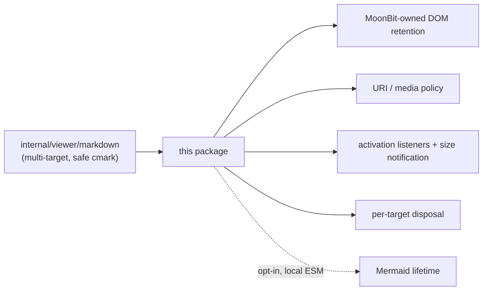

# internal/viewer/browser/markdown

MoonBit-owned DOM policy and lifetime management for shared browser Markdown
rendering, with narrow JS bindings for browser parsing, URL resolution, target
registries, dynamic import, and Mermaid API calls.

> The code blocks on this page are `mbt nocheck`. This package is js-only and
> its values need a live DOM, which `moon test` (Node, no DOM) cannot provide.
> Its executable coverage is the Playwright suites under `tests/browser/`; see
> `docs/harness.md` for how to choose a test layer.



The full Markdown document presentation and root Markdown-comment contribution
emit the exact lowercase `mermaid` marker and enable the Mermaid lifetime;
hover and agent feedback remain ordinary tokenized-code consumers.

```mbt nocheck
// A renderer owns its target node and is disposed per target.
let renderer = MarkdownRenderer::new(target, policy)
renderer.set_markdown(source)      // parses once, retains the DOM it produced
renderer.dispose()                 // detaches listeners and observers
```

`render_markdown` converts through `internal/viewer/markdown`, postprocesses the
result in an inert template, and then replaces the children of an explicit
reusable target (or a newly created `div`). Links and images are resolved and
sanitized before insertion. Action-handler links never retain native
navigation; native links are limited to HTTP, HTTPS, and mailto. Images are
removed by default and, when enabled, are limited to HTTP(S).

`RenderedMarkdown.projection` is the exact DOM-free
`MarkdownDocumentProjection` produced by the same cmark parse and configuration
as its installed HTML. Browser consumers must retain this value instead of
parsing source again.

Scrollable diagram wrappers retain native wheel scrolling while they can
consume the current delta. When neither axis can consume it, the event is
allowed to reach the owning hover, widget, or editor scroller.

Interactive presentation for successful direct Diago, UML, and Mermaid SVGs
lives in the public browser-only
`viewer/browser/diagram_viewport` package. Editor Markdown documents, Markdown
comments, and Desktop transcripts share that package's `DiagramViewports`
lifetime and stylesheet; this renderer owns only the wrapper markup and its
generic native-scroll fallback.

`moonbit-viewer-markdown-diagram-viewport` is also an event-time ownership
marker: while a wrapper carries it, the generic listener never stops ordinary
wheel input. The viewport controller can therefore mount after the renderer
listener and return ordinary wheel input to the owning scroller while owning
modifier-zoom events. Removing the marker restores the native inner-scroll
handoff, so hover and agent-feedback diagrams keep their existing behavior.

Mermaid rendering is an explicit browser-only opt-in. Pass
`mermaid_theme=Light` or `mermaid_theme=Dark` and emit a
`div.moonbit-viewer-markdown-diagram[data-diagram-language="mermaid"]` whose
text content is the safe source fallback. The adapter lazily imports Mermaid's
official ESM build from `mermaid/mermaid.esm.min.mjs`, resolved against the
document resource base; no marked wrapper means no import. The editor web build
downloads the pinned `mermaid@11.16.0` npm archive, verifies SHA-256, and
stages that entry with all of its relative ESM chunks. `Light` selects
Mermaid's `default` theme and
`Dark` selects `dark`. Call `RenderedMarkdown::rerender_mermaid` when the
retained target's theme changes. Source extraction preserves the tokenized
fallback's line structure by translating its `<br>` elements back to newline
characters before invoking Mermaid.

One realm-wide MoonBit runtime caches the loaded Mermaid API, retries after a
failed load, and serializes `initialize` plus `render`. It applies strict
security, suppresses source-side error rendering, and protects theme
configuration from diagram frontmatter. MoonBit-owned per-diagram epochs,
target ownership, and containment checks reject stale commits. A successful
SVG replacement invokes the existing size callback. Loading, CSP, syntax,
stale-result, target-reuse, and disposal failures retain the source fallback or
last successful SVG.

The full-document and whole-line Markdown-comment consumers also use that size
callback to refresh their shared diagram-viewport owner. Successful Mermaid SVGs
therefore receive the same pan, zoom, fit, and resize controls as synchronous
Diago and UML SVGs; a theme rerender disposes the controller for the replaced
SVG and mounts a fresh one.

Hosts using Mermaid must ship the generated `mermaid/` tree at the document
resource base, allow same-origin module scripts in the applicable CSP
directive, and allow Mermaid's inline SVG styling. The pinned archive URL plus
its checked SHA-256 digest is the reproducibility boundary. A missing or blocked
local asset remains usable through the visible source fallback.

The returned `RenderedMarkdown.dispose` releases the MoonBit-owned listener
disposables and makes late load and Mermaid callbacks inert. A realm-wide
`WeakMap` only registers the current MoonBit lifetime token for each reusable
target; rendering into that target first disposes its previous renderer-owned
lifetime while leaving the caller-owned target itself in place.

Run the focused JS suite with:

```sh
moon test internal/viewer/browser/markdown --target js
```
