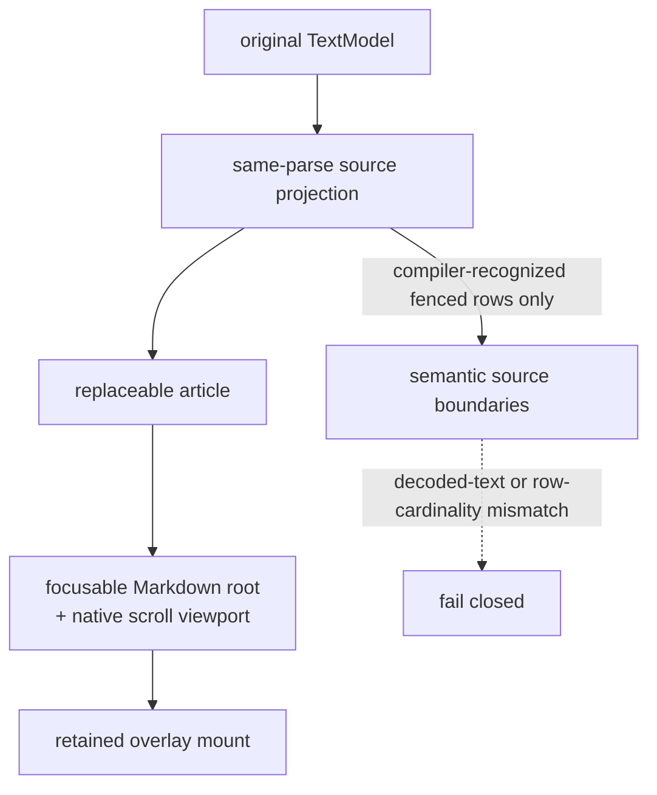

# internal/viewer/browser/markdown_document

JS-only document presentation owned by the Viewer layer. It keeps a focusable
root, a native scroll viewport, a reusable Markdown article target, and a
viewport-fixed overlay mount as separate DOM capabilities.

> The code blocks on this page are `mbt nocheck`. This package is js-only and
> its values need a live DOM, which `moon test` (Node, no DOM) cannot provide.
> Its executable coverage is the Playwright suites under `tests/browser/`; see
> `docs/harness.md` for how to choose a test layer.



The package owns no model, provider, marker store, or request policy. Root and
the hover browser package own those higher-level contracts.

```mbt nocheck
// MarkdownViewer installs this as its rich-document presentation.
let document_view = MarkdownDocumentView::new(host, model_source)
document_view.set_source(projection)  // replaces the article, keeps the root
document_view.dispose()
```

Rendering delegates to `internal/viewer/browser/markdown`. The retained
`MarkdownDocumentProjection` is therefore the exact projection produced by the
same cmark parse as the installed HTML. Every source or theme replacement
advances `projection_generation` and records the source model content version.
The view also mounts the shared `DiagramViewports` lifetime on its
article. Synchronous D2/Diago and UML SVGs, plus asynchronously committed
Mermaid SVGs, receive pan, zoom, fit, and resize controls; replacement and
disposal release that lifetime before the renderer mutates or removes the
article DOM.
The single post-render pass stamps source anchors and leaves stable
`data-markdown-code-block="<block_index>"` wrappers for source-aware browser
features. Compiler-recognized `mbt check` fences additionally expose one
source-bearing DOM row per projected code line. Each row retains the exact
`MarkdownCodeLine`, block source range, and rendered element; synthetic
Markdown indentation remains outside the semantic text boundary. Tokenization
consumes the projected lines in order, preserving cross-line tokenizer state,
and each row receives its source attributes while its token HTML is emitted.
A cardinality or decoded-text mismatch fails closed by
removing the semantic attributes and registry entry.
An exact source-bearing, column-zero `///|` row is additionally presented as a
full-width horizontal item divider. Its tokenized text remains in the DOM and
its `MarkdownCodeLine` remains in the semantic registry, so the visual
substitution does not change source validation, coordinates, or model content.
Marker lines carrying text and indented `///|` comments remain ordinary code.

The semantic DOM registry and its listeners are replacement-scoped: they are
disposed before the article renderer, rebuilt after each successful render,
and drained on view disposal. The package owns no model, provider, marker
store, or source-coordinate policy. Root `viewer` and the hover contribution
own presentation selection, content subscriptions, original-model coordinate
conversion, request freshness, and feature lifetime. The overlay mount is
deliberately outside the replaceable article so hover DOM is retained across a
content refresh and explicitly invalidated by its owner.

Run the focused suite with:

```sh
moon test --target js internal/viewer/browser/markdown_document
```

## Section folding operations

The view owns two fold mechanics and no fold policy:

- `set_hidden_root_elements` marks a run of article root elements with
  `data-markdown-section-hidden`, which the stylesheet maps to `display:none`.
  Pure visibility over retained nodes -- never a re-render, never a projection
  rebuild, never a `projection_generation` change -- so the `.mbt.md` semantic
  hover contract survives folding untouched. `display:none` specifically:
  it removes the subtree from hit testing and the accessibility tree, so
  `caretPositionFromPoint` fails closed over collapsed content.
- `install_section_fold_controls` places one real `<button>` (`aria-expanded`,
  `aria-label`, CSS chevron from `data-collapsed`) as each foldable heading's
  first child; one delegated article click listener installed at construction
  routes toggle clicks to the handler set by
  `set_section_fold_toggle_handler`.
- `set_toc_entries` exposes outlines of at least three sections through a
  compact, overlaid navigation panel. The collapsed summary stays outside
  article flow and projection ordinals; activating a row collapses the panel,
  restores focus to its toggle without scrolling, and hands the source offset
  to the root Viewer for expansion and reveal.

Which sections exist, what starts collapsed, and how state survives a source or
theme replacement belong to the root Viewer (`viewer/markdown_folding.mbt`).
