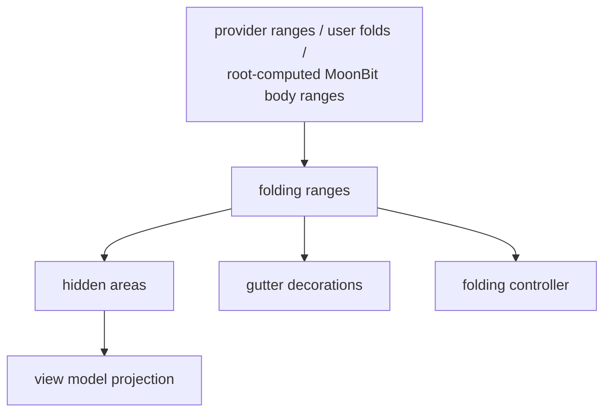

# internal/viewer/contrib/folding/browser

The JS-target folding implementation. It owns folding ranges and regions,
indent-based range computation, folding decorations, hidden-range projection,
selection adjustment, and the per-Viewer folding controller state.

> The code blocks on this page are `mbt nocheck`. This package is js-only and
> its values need a live DOM, which `moon test` (Node, no DOM) cannot provide.
> Its executable coverage is the Playwright suites under `tests/browser/`; see
> `docs/harness.md` for how to choose a test layer.



This package currently owns the complete js-only folding implementation. The
root Viewer computes MoonBit function-body ranges without importing a concrete
syntax package; ordinary provider/user folding remains the Monaco behavior port.

```mbt nocheck
// Hidden areas are the only thing folding publishes into the view model.
controller.toggle_fold(line_number)
view_model.set_hidden_areas(controller.hidden_areas(), source="folding")
|> ignore
```

The root Viewer integrates these values with model events and cursor
selection. The package must remain independent of the root `viewer`, browser
view/controller, and shell packages. Its emitted stylesheet remains at
`viewer/contrib/folding/browser/folding.css`.

The root may compose a host-computed range with
`OUTLINE_BODY_FOLDING_RANGE_TYPE` before an explicit outline action. The range
uses its complete declaration header's final line as the ordinary fold header,
so the standard hidden-range model needs no partial-line projection. Its
collapsed decoration keeps the chevron and completes the hidden body with an
inline `… }` suffix. Ordinary folds retain their trailing ellipsis. Collapsed
rows have no background tint, so they cannot be mistaken for selected lines.

Exact callable types are in `pkg.generated.mbti`. Run focused tests with:

```sh
moon test internal/viewer/contrib/folding/browser --target js
```
