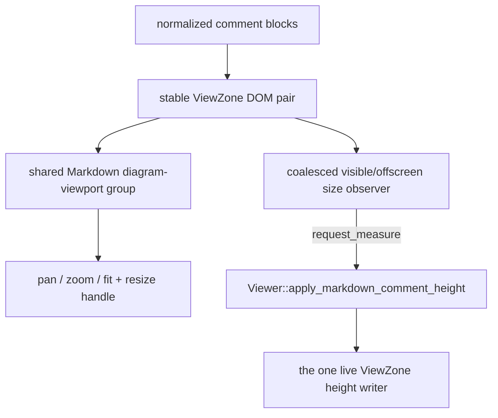

# internal/viewer/contrib/markdown_comments/browser

JS-only DOM and measurement ownership for rendered whole-line Markdown
comments. `MarkdownCommentDom` creates the stable ViewZone outer/content pair
plus a caller-owned margin ViewZone node; the root contribution retains the
outer node as its ViewZone DOM, registers the margin node so ViewZones keeps
it top/height-synced in the gutter, and renders shared Markdown into
independent full and one-line preview targets inside the measured inner node.
Every block also owns an initially empty source target. Its accessible
in-content control lazily extracts and tokenizes the exact original model lines
only when that block first selects source; a visible same-range replacement
refreshes the target while a hidden block defers the work until its next reveal.
Returning to Markdown restores the prior documentation-fold state. The toggle keeps the stable
accessible name `Original source`, reports the selected presentation through
`aria-pressed`, and uses its tooltip for the next action. Rendered content
always reserves its trailing hit area, while a one-line separator constrains
the control to the existing ViewZone height.
Item-delimited multi-line API documents whose provider registration opted
into folding start on the preview. Two affordances drive one fold state: a
mouse-only gutter chevron that reuses the code-folding `.cldr` codicons and
sits on the same line-decorations column (the whole margin plane is
`aria-hidden`, Monaco parity), and an accessible in-content button that stays
invisible until pointer hover or keyboard focus and carries the
`aria-expanded` state. Both report through the existing size invalidation
callback. `set_margin_fold_lane_width` initializes the chevron lane from the
configured `lineDecorationsWidth` at mount and resynchronizes it after runtime
decorations-lane changes. Ordinary Markdown,
separator-only blocks, and one-line API docs keep the full target and do not
expose a fold control. The root retains the source/expanded state and renderer
lifetimes so same-key body replacement preserves the user's choices while a
newly mounted block starts rendered and, when foldable, collapsed.

> The code blocks on this page are `mbt nocheck`. This package is js-only and
> its values need a live DOM, which `moon test` (Node, no DOM) cannot provide.
> Its executable coverage is the Playwright suites under `tests/browser/`; see
> `docs/harness.md` for how to choose a test layer.



Each successful direct Diago, UML, or Mermaid SVG is enhanced independently with
bounded pan/zoom/fit controls and a resize handle. Mermaid's asynchronous
render and theme-rerender callbacks refresh the group: current controllers keep
their state, while a replaced SVG's stale controller is disposed before the
new SVG is enhanced. MoonBit structs own each group's controllers, geometry
state, listeners, observers, queued frame, and disposal; no ownership state is
written onto caller DOM.

```mbt nocheck
// The parent rendered entry guarantees exclusive wrapper ownership and disposes
// the viewport group before the renderer replaces its target.
entry.viewport_group.dispose()
entry.renderer.set_markdown(next_source)
```

The shared ViewZones container hides caller nodes individually by default.
After registration, `expose_accessible_content` removes that default only from
the Markdown zone, allowing its links and source/fold buttons into the
accessibility tree without exposing unrelated ViewZones. Zone removal restores
the caller's original `aria-hidden` state.

`observe_size` watches only the auto-height inner content. The root
contribution owns one model-scoped viewport-width observer and invalidates all
live comment size observers when that width changes. Resize notifications and
explicit viewport/renderer/image invalidations are coalesced through the
caller-owned `MarkdownCommentMeasureBatch`, which runs one measurement pass
per animation frame for every zone of its owner (scheduled through the
realm-global `base/browser` animation-frame coordinator). A pass reads every
directly measurable height first, then shows every still-hidden connected
ViewZone invisibly at once, reads all of their heights, restores their styles,
and only then reports the changed integer heights before calling
`on_pass_complete` once. Separating the writes from the reads keeps a document
with thousands of doc comments at a constant number of forced layouts per
pass instead of one per zone. Hidden measurement uses the zone's already
pinned viewport-safe width and horizontal offset; it never replaces `width`
or `left`, and every touched inline style and priority is restored before
any height is reported. The returned `MarkdownCommentSizeObserver` exposes
`request_measure` and idempotent `dispose`; zero-size restore notifications
cannot create a feedback loop. Disposal disconnects observation and makes late
notifications inert; disposing the batch cancels its queued frame work. The
root contribution remains responsible for the shared viewport observer,
geometry lease, generation, zone-id freshness, and for publishing the
reported heights in one ViewZone transaction at pass completion.

The shared `DiagramViewports` lifetime owns every successfully
rendered direct Diago, UML, or Mermaid SVG viewport inside one Markdown-comment
target. It mounts the transformable content, four controls, resize handle,
listeners, animation frame, and per-wrapper `ResizeObserver`, while leaving
the target and original wrapper caller-owned. Initial height is bounded to the
smaller of the SVG's natural height, half the owning window, and 480px. A
diagram that reaches that cap starts with the same 16px-padded Fit transform
used by the toolbar action; uninteracted layout tracks window and wrapper
changes, while a caller-selected resize height remains authoritative. Failed
Mermaid renders retain their noninteractive source fallback. MoonBit structs
retain the group/controller lifetime and all pan/zoom/fit/resize state. The
root entry's
disposal-before-replacement contract gives the group exclusive wrapper
ownership, so the implementation does not place private ownership tokens on
DOM nodes. A module-private per-document coordinator grants at most one
temporary body-cursor lease during resize; it restores the exact prior inline
value and priority on release. Narrow FFI fills browser binding gaps only. Each
inline viewport-height change invokes the supplied `on_size_changed` callback;
the root contribution wires that callback to the existing coalesced
`MarkdownCommentSizeObserver::request_measure` path rather than introducing
another ViewZone height writer. The root entry disposes the diagram owner
before the shared Markdown renderer and size observer whenever the body is
replaced or its ViewZone is removed.

Comment-specific styles remain at
`viewer/contrib/markdown_comments/browser/markdown_comments.css`; shared
diagram controls are styled by
`viewer/browser/diagram_viewport/diagram_viewport.css`. Run the focused JS
suite with:

```sh
moon test internal/viewer/contrib/markdown_comments/browser --target js
```
