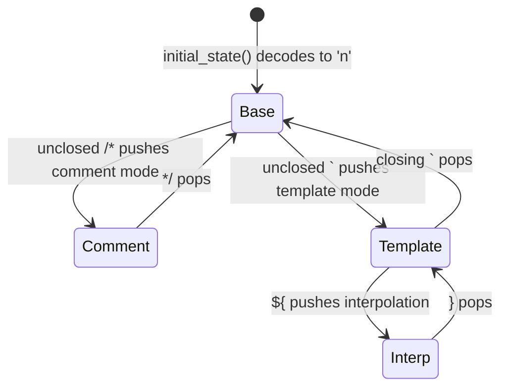

# syntax/lang_javascript

The JavaScript lexer. It implements `@syntax.LineTokenizer` with a compile-time
`lexmatch` DFA.

`JavascriptTokenizer` is the whole public surface. Hosts, examples, and tests
select it explicitly; reusable viewer core packages must not import it.

This is the only `lang_*` that carries a persistent stack because JavaScript is
the only one of the three with genuinely *nested* multi-line constructs. The
empty state is normal code; each open construct pushes one byte.

## Reading a token stream

```mbt check
///|
/// Renders each token as `text|tag`, carrying tokenizer state line to line.
fn annotate(
  tokenizer : &@syntax.LineTokenizer,
  lines : ArrayView[String],
) -> Array[String] {
  let rendered = []
  for line in lines; state = tokenizer.initial_state() {
    let (tokens, next_state) = tokenizer.tokenize_line(line, state)
    for token in tokens {
      rendered.push("\{line[token.start:token.end]}|\{token.tag}")
    }
    continue next_state
  }
  rendered
}
```

## Lexical classes

```mbt check
///|
test "declarations separate keywords, identifiers, and literals" {
  debug_inspect(
    annotate(@lang_javascript.JavascriptTokenizer(), [
      "export const answer = compute(42, \"text\");",
    ]),
    content=(
      #|[
      #|  "export|Keyword",
      #|  "const|Keyword",
      #|  "answer|Identifier",
      #|  "=|Operator",
      #|  "compute|Identifier",
      #|  "(|Delimiter",
      #|  "42|Number",
      #|  ",|Delimiter",
      #|  "\"text\"|String",
      #|  ");|Delimiter",
      #|]
    ),
  )
}
```

## Cross-line state and the mode stack

The state is a *stack* — one character per open mode — because a template
literal can contain an interpolation which can itself contain another template
literal. A single flag could not express that nesting.



A block comment survives the line boundary:

```mbt check
///|
test "block comments carry across lines" {
  debug_inspect(
    annotate(@lang_javascript.JavascriptTokenizer(), [
      "/* start", " * middle", " */ const x = 1;",
    ]),
    content=(
      #|[
      #|  "/* start|Comment",
      #|  " * middle|Comment",
      #|  " */|Comment",
      #|  "const|Keyword",
      #|  "x|Identifier",
      #|  "=|Operator",
      #|  "1|Number",
      #|  ";|Delimiter",
      #|]
    ),
  )
}
```

So does an open template literal, including its interpolation holes:

```mbt check
///|
test "template literals span lines and keep interpolations separate" {
  debug_inspect(
    annotate(@lang_javascript.JavascriptTokenizer(), [
      "const t = `line one ${", "  value", "} line two`;",
    ]),
    content=(
      #|[
      #|  "const|Keyword",
      #|  "t|Identifier",
      #|  "=|Operator",
      #|  "`line one |String",
      #|  "${|StringEscape",
      #|  "value|Identifier",
      #|  "}|StringEscape",
      #|  " line two`|String",
      #|  ";|Delimiter",
      #|]
    ),
  )
}
```

The state at each line boundary supports only the stack operations the lexer
needs. Its backing list stays opaque.

```mbt check
///|
test "the carried state exposes stack transitions" {
  let tokenizer : &@syntax.LineTokenizer = @lang_javascript.JavascriptTokenizer()
  let initial = tokenizer.initial_state()
  let (_, in_template) = tokenizer.tokenize_line("const t = `open", initial)
  let (_, in_interp) = tokenizer.tokenize_line("still ${", in_template)
  let (_, closed) = tokenizer.tokenize_line("} done`;", in_interp)
  assert_true(initial.last_mode() is None)
  assert_true(in_template.last_mode() == Some(b't'))
  assert_true(in_interp.last_mode() == Some(b'i'))
  assert_true(in_interp.pop_mode() == in_template)
  assert_true(closed == initial)
}
```

## Boundaries and checks

This package may depend only on `syntax`. It shares `@syntax.push_token` and
`@syntax.is_capitalized` with `lang_moonbit` rather than carrying private
copies. The complete API is `pkg.generated.mbti`; the line-tokenizer contract
and the porting rules live in `syntax/README.mbt.md`.

```sh
moon test --target js syntax/lang_javascript
```
