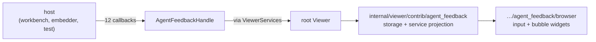

# Agent-feedback host API

This multi-target package owns the feedback DTOs, event values, and opaque
callback handle that may cross the public Viewer service boundary. It imports
only `base/common`; concrete storage, mutation policy, persistence, and browser
widgets remain in `internal/viewer/contrib/agent_feedback` and its browser
package.



## The value shapes

An `AgentFeedback` item is identified by a `String` id within a resource, and
carries the range it annotates, its `kind`, its `state`, and its replies.
`selected_text` is an optional snapshot of the user's visible selection,
independent of the source range. Rendered Markdown selections provide it even
when their source mapping covers a whole block. An explicitly empty snapshot
(`Some("")`, for example an image-only selection) must not be replaced with
source text; `None` means no snapshot was supplied.

```mbt check
///|
test "a feedback item is an id, a place, a kind, a state, and replies" {
  let item : @agent_feedback_api.AgentFeedback = {
    id: "fb-1",
    text: "This branch is unreachable.",
    resource: @base_common.Uri::parse("file:///src/main.mbt"),
    range: Range(12, 3, 12, 20),
    selected_text: None,
    kind: AgentReview,
    replies: ["Agreed.", "Fixed in the next commit."],
    state: Accepted,
  }
  debug_inspect(
    (item.id, item.kind, item.state, item.replies.length()),
    content=(
      #|("fb-1", AgentReview, Accepted, 2)
    ),
  )
}
```

`AgentFeedbackKind` separates a human's note from an agent's, and
`AgentFeedbackState` is the lifecycle. They are independent: an agent review can
be `Created` and a user review can be `Resolved`.

```mbt check
///|
test "kind and state are independent axes" {
  let kinds : Array[@agent_feedback_api.AgentFeedbackKind] = [
    UserReview,
    AgentReview,
  ]
  let states : Array[@agent_feedback_api.AgentFeedbackState] = [
    Created,
    Accepted,
    Submitted,
    Resolved,
  ]
  debug_inspect(
    (kinds, states),
    content=(
      #|([UserReview, AgentReview], [Created, Accepted, Submitted, Resolved])
    ),
  )
}
```

`AgentFeedbackNavigationBearing` is what a "3 of 7" indicator renders from;
`active_idx` is a position within `total_count`.

```mbt check
///|
test "a navigation bearing is a position within a count" {
  let bearing : @agent_feedback_api.AgentFeedbackNavigationBearing = {
    active_idx: 2,
    total_count: 7,
  }
  debug_inspect(
    bearing,
    content=(
      #|{ active_idx: 2, total_count: 7 }
    ),
  )
}
```

## The callback floor

`AgentFeedbackHandle(...)` requires the complete reviewed twelve-callback floor.
The handle forwards those operations without owning captured state or
lifecycle. External hosts can therefore inject a custom implementation through
`ViewerServices` without importing a contribution package, while the reference
workbench derives the same handle from its retained concrete service.

Because every callback is required, adding one is a deliberate, reviewable
change to the host contract rather than a silently optional extension. The
example below is a complete minimal host: an in-memory store that satisfies the
whole floor.

```mbt check
///|
/// A complete but minimal host implementation of the twelve-callback floor.
fn in_memory_handle(
  items : Array[@agent_feedback_api.AgentFeedback],
  log : Array[String],
) -> @agent_feedback_api.AgentFeedbackHandle {
  AgentFeedbackHandle(
    on_did_change_feedback=_ => @base_common.Disposable::from(() => ()),
    on_did_change_navigation=_ => @base_common.Disposable::from(() => ()),
    is_feedback_enabled=uri => uri.scheme == "file",
    get_feedback=uri => items.filter(item => item.resource == uri),
    get_navigation_bearing=(_uri, ids) => {
      active_idx: 0,
      total_count: ids.length(),
    },
    add_feedback=(uri, range, text, kind, state, selected_text) => {
      let item : @agent_feedback_api.AgentFeedback = {
        id: "fb-\{items.length() + 1}",
        text,
        resource: uri,
        range,
        selected_text,
        kind: kind.unwrap_or(UserReview),
        replies: [],
        state: state.unwrap_or(Created),
      }
      items.push(item)
      item
    },
    mark_feedback_submitted=_ => log.push("submitted"),
    remove_feedback=(_uri, id) => log.push("remove \{id}"),
    accept_feedback=(_uri, id) => log.push("accept \{id}"),
    set_navigation_anchor=(_uri, anchor) => {
      log.push("anchor \{anchor.unwrap_or("none")}")
    },
    update_feedback=(_uri, id, text) => log.push("update \{id} -> \{text}"),
    add_reply=(_uri, id, reply) => log.push("reply \{id} -> \{reply}"),
  )
}

///|
test "the handle forwards each operation to its host callback" {
  let items : Array[@agent_feedback_api.AgentFeedback] = []
  let log = []
  let handle = in_memory_handle(items, log)
  let uri = @base_common.Uri::parse("file:///src/main.mbt")
  let created = handle.add_feedback(uri, Range(4, 1, 4, 9), "Look here")
  handle.accept_feedback(uri, created.id)
  handle.add_reply(uri, created.id, "Acknowledged")
  handle.update_feedback(uri, created.id, "Look here instead")
  handle.set_navigation_anchor(uri, Some(created.id))
  handle.mark_feedback_submitted(uri)
  handle.remove_feedback(uri, created.id)
  debug_inspect(
    (
      (created.id, created.kind, created.state),
      handle.get_feedback(uri).length(),
      handle.is_feedback_enabled(uri),
      handle.is_feedback_enabled(@base_common.Uri::parse("memory:///scratch")),
      handle.get_navigation_bearing(uri, [created.id]),
      log,
    ),
    content=(
      #|(
      #|  ("fb-1", UserReview, Created),
      #|  1,
      #|  true,
      #|  false,
      #|  { active_idx: 0, total_count: 1 },
      #|  [
      #|    "accept fb-1",
      #|    "reply fb-1 -> Acknowledged",
      #|    "update fb-1 -> Look here instead",
      #|    "anchor fb-1",
      #|    "submitted",
      #|    "remove fb-1",
      #|  ],
      #|)
    ),
  )
}
```

Omitted optional arguments are resolved by the *host*, not by the handle: the
handle passes `None` through, and the example above defaults to
`UserReview`/`Created`.

```mbt check
///|
test "optional kind and state arrive at the host as None" {
  let items : Array[@agent_feedback_api.AgentFeedback] = []
  let handle = in_memory_handle(items, [])
  let uri = @base_common.Uri::parse("file:///src/main.mbt")
  let defaulted = handle.add_feedback(uri, Range(1, 1, 1, 1), "a")
  let explicit = handle.add_feedback(
    uri,
    Range(2, 1, 2, 1),
    "b",
    kind=AgentReview,
    state=Submitted,
  )
  debug_inspect(
    ((defaulted.kind, defaulted.state), (explicit.kind, explicit.state)),
    content=(
      #|((UserReview, Created), (AgentReview, Submitted))
    ),
  )
}
```

## Event values

`AgentFeedbackChangeEvent` is the active generic handle payload.
`exports.mbt` holds the two host-facing payloads, whose public visibility is
owed to consumers outside this repository rather than to any in-repo call
site. `AgentFeedbackSubmittedEvent` is the planned agent-loop payload; it
carries counts alongside the items so a future host can render a summary
without walking the array. `AgentFeedbackAddedEvent` is the accepted-item
payload a host publishes from its own feedback store's emitter, without
consuming the viewer's service. The reply notification has no such consumer
and remains private to the concrete service.

```mbt check
///|
test "a submitted event carries its own counts" {
  let uri = @base_common.Uri::parse("file:///src/main.mbt")
  let event : @agent_feedback_api.AgentFeedbackSubmittedEvent = {
    resource: uri,
    items: [],
    user_count: 2,
    agent_review_count: 1,
    reply_count: 3,
  }
  debug_inspect(
    (event.user_count, event.agent_review_count, event.reply_count),
    content=(
      #|(2, 1, 3)
    ),
  )
}
```

## Boundaries

See `pkg.generated.mbti` for the exact value and callback contracts.

```sh
moon test --target js viewer/common/agent_feedback_api
```
