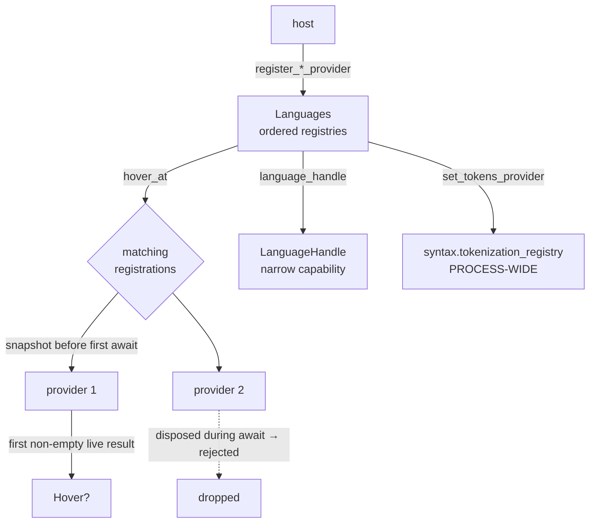

# viewer/common/languages

The viewer's DOM-free language registry and token-to-HTML helpers.

`language` defines *what* a provider is. This package is *where they live* and
*how a request is resolved* when several match.



## Registered features

Ordered, disposable registries exist for hover, definitions, references,
document symbols, and whole-line Markdown comments. Hover, definition, and
reference requests snapshot matching registrations before their first await,
forward the caller's exact cancellation token, reject a result from a
registration disposed during the await, and keep cancellation silent; ordinary
provider failures are logged and contained. `hover_at` returns the first
non-empty live result. Definition and reference requests build one task per
matching provider and concatenate every still-live result in Monaco registry
priority: selector score descending, then newest registration first. Exact
language/scheme/path matches score above language/scheme wildcards; an
unconstrained filter does not match. The runtime-neutral default runner is
sequential; browser hosts inject their Promise-backed concurrent runner without
coupling this package to a specific async runtime.

Definition- and references-provider presence can be queried without launching a
provider, both from `Languages` and the borrowed `LanguageHandle`.

```mbt check
///|
priv struct FixedHover {
  text : String
}

///|
impl @language.HoverProvider for FixedHover with fn provide_hover(
  self,
  _model,
  position,
  _token,
) {
  Some({
    range: Range(
      position.line_number,
      position.column,
      position.line_number,
      position.column + 1,
    ),
    contents: [PlainText(self.text)],
  })
}

///|
fn doc_model(text : String) -> @model.TextModel raise {
  TextModel(
    @base_common.Uri::parse("file:///languages-doc.mbt"),
    "languages-doc.mbt",
    "moonbit",
    1,
    "rev-1",
    text,
  )
}

///|
async test "hover_at returns the first non-empty result in registry priority" {
  let registry = @languages.Languages()
  let log = @log.LogService(logger=@log.NullLogger())
  registry.register_hover_provider(LanguageId("moonbit"), FixedHover::{
    text: "first",
  })
  |> ignore
  registry.register_hover_provider(LanguageId("moonbit"), FixedHover::{
    text: "second",
  })
  |> ignore
  let model = doc_model("fn main {}\n")
  let hover = registry.language_handle(log.log_handle()).hover_at(model, 1)
  debug_inspect(
    hover.map(h => h.contents),
    content=(
      #|Some([PlainText("second")])
    ),
  )
}
```

A registration that is disposed while a request is in flight cannot contribute
its result. Hover requests snapshot matching registrations before their first
await, forward the caller's exact cancellation token, reject a result from a
registration disposed during the await, and keep cancellation silent; ordinary
provider failures are logged and contained.

```mbt check
///|
async test "a disposed registration cannot win a race it is no longer in" {
  let registry = @languages.Languages()
  let log = @log.LogService(logger=@log.NullLogger())
  let registration = registry.register_hover_provider(LanguageId("moonbit"), FixedHover::{
    text: "retired",
  })
  registration.dispose()
  let model = doc_model("fn main {}\n")
  debug_inspect(
    registry.language_handle(log.log_handle()).hover_at(model, 1) is Some(_),
    content=(
      #|false
    ),
  )
}
```

Selectors decide matching, so a provider registered for another language is
simply not consulted.

```mbt check
///|
async test "a non-matching selector is never consulted" {
  let registry = @languages.Languages()
  let log = @log.LogService(logger=@log.NullLogger())
  registry.register_hover_provider(LanguageId("json"), FixedHover::{
    text: "json-only",
  })
  |> ignore
  let model = doc_model("fn main {}\n")
  debug_inspect(
    registry.language_handle(log.log_handle()).hover_at(model, 1) is Some(_),
    content=(
      #|false
    ),
  )
}
```

## Markdown comments

Markdown-comment lookup returns the first matching provider's raw synchronous
result. `None` means no provider matched; `Some([])` is authoritative. A
provider failure is logged and remains authoritative as `Some([])` so a later
provider or configuration fallback cannot silently replace it.

That three-way distinction — "nobody answered", "answered with nothing", and
"answered with blocks" — is the whole point of the `Array[...]?` return type.

```mbt check
///|
priv struct FirstLineComment {}

///|
impl @language.MarkdownCommentProvider for FirstLineComment with fn provide_markdown_comments(
  _self,
  _model,
) {
  [{ line_range: LineRange(1, 2), markdown: "# Title", }]
}

///|
priv struct SilentProvider {}

///|
impl @language.MarkdownCommentProvider for SilentProvider with fn provide_markdown_comments(
  _self,
  _model,
) {
  []
}

///|
test "None, Some([]), and Some(blocks) are three different answers" {
  let log = @log.LogService(logger=@log.NullLogger())
  let model = doc_model("fn main {}\n")
  let unregistered = @languages.Languages()
  let silent = @languages.Languages()
  silent.register_markdown_comment_provider(LanguageId("moonbit"), SilentProvider::{
  })
  |> ignore
  let answering = @languages.Languages()
  answering.register_markdown_comment_provider(LanguageId("moonbit"), FirstLineComment::{
  })
  |> ignore
  debug_inspect(
    (
      unregistered
      .language_handle(log.log_handle())
      .markdown_comment_provider_render_result(model)
      .map(result => result.blocks),
      silent
      .language_handle(log.log_handle())
      .markdown_comment_provider_render_result(model)
      .map(result => result.blocks),
      answering
      .language_handle(log.log_handle())
      .markdown_comment_provider_render_result(model)
      .map(result => result.blocks),
    ),
    content=(
      #|(
      #|  None,
      #|  Some([]),
      #|  Some(
      #|    [
      #|      {
      #|        line_range: { start_line_number: 1, end_line_number_exclusive: 2 },
      #|        markdown: "# Title",
      #|      },
      #|    ],
      #|  ),
      #|)
    ),
  )
}
```

Registration may additionally opt the winning provider into foldable
API-document presentation; the render-result lookup captures that flag and the
raw blocks from the same registry entry, so the two can never disagree.

```mbt check
///|
test "the foldable flag travels with the winning registration" {
  let log = @log.LogService(logger=@log.NullLogger())
  let model = doc_model("fn main {}\n")
  let plain = @languages.Languages()
  plain.register_markdown_comment_provider(LanguageId("moonbit"), FirstLineComment::{
  })
  |> ignore
  let foldable = @languages.Languages()
  foldable.register_markdown_comment_provider(
    LanguageId("moonbit"),
    FirstLineComment::{ },
    foldable=true,
  )
  |> ignore
  debug_inspect(
    (
      plain
      .language_handle(log.log_handle())
      .markdown_comment_provider_render_result(model)
      .map(r => (r.foldable, r.blocks.length())),
      foldable
      .language_handle(log.log_handle())
      .markdown_comment_provider_render_result(model)
      .map(r => (r.foldable, r.blocks.length())),
    ),
    content=(
      #|(Some((false, 1)), Some((true, 1)))
    ),
  )
}
```

## Language configuration

`set_language_configuration` stores the normalized comments and folding-rules
slices of Monaco's `LanguageConfiguration`. An unconfigured language reads back
as an all-`None` configuration rather than raising.

```mbt check
///|
test "configuration round-trips, and an unset language reads back empty" {
  let registry = @languages.Languages()
  registry.set_language_configuration("moonbit", {
    comments: Some({
      line_comment: Some(LineCommentRule("//")),
      block_comment: Some({ open: "/*", close: "*/", }),
    }),
    folding_rules: Some({ off_side: false, markers: None, }),
  })
  debug_inspect(
    (
      registry
      .language_handle(@log.LogService(logger=@log.NullLogger()).log_handle())
      .get_language_configuration("moonbit").comments,
      registry
      .language_handle(@log.LogService(logger=@log.NullLogger()).log_handle())
      .get_language_configuration("never-configured").comments,
    ),
    content=(
      #|(
      #|  Some(
      #|    {
      #|      line_comment: Some({ comment: "//", no_indent: false }),
      #|      block_comment: Some({ open: "/*", close: "*/" }),
      #|    },
      #|  ),
      #|  None,
      #|)
    ),
  )
}
```

Empty present comment delimiters are **rejected by aborting**, not by being
dropped or normalized away. A present-but-empty delimiter is a caller
programming error rather than a runtime condition, so it fails loudly at
registration instead of producing a configuration that silently comments
nothing out.

```mbt check
///|
test "panic an empty line-comment delimiter aborts registration" {
  @languages.Languages().set_language_configuration("broken", {
    comments: Some({
      line_comment: Some(LineCommentRule("")),
      block_comment: None,
    }),
    folding_rules: None,
  })
}
```

```mbt check
///|
test "panic an empty block-comment delimiter aborts registration" {
  @languages.Languages().set_language_configuration("broken", {
    comments: Some({
      line_comment: None,
      block_comment: Some({ open: "/*", close: "", }),
    }),
    folding_rules: None,
  })
}
```

Region markers remain whole-line predicates rather than regular expressions.

Folding markers are predicates over a whole line, so a caller supplies matching
logic rather than a regular expression the registry would have to compile.

```mbt check
///|
test "folding markers are whole-line predicates" {
  let registry = @languages.Languages()
  registry.set_language_configuration("moonbit", {
    comments: None,
    folding_rules: Some({
      off_side: true,
      markers: Some({
        start: line => line.trim(chars=" ").has_prefix("//#region"),
        end: line => line.trim(chars=" ").has_prefix("//#endregion"),
      }),
    }),
  })
  let log = @log.LogService(logger=@log.NullLogger())
  let rules = registry
    .language_handle(log.log_handle())
    .get_language_configuration("moonbit").folding_rules
  debug_inspect(
    rules.map(r => {
      (
        r.off_side,
        r.markers.map(m => {
          (
            (m.start)("  //#region setup"),
            (m.start)("let x = 1"),
            (m.end)("//#endregion"),
          )
        }),
      )
    }),
    content=(
      #|Some((true, Some((true, false, true))))
    ),
  )
}
```

## The one global

`set_tokens_provider` forwards to the process-wide
`syntax.tokenization_registry`. Therefore tokenizer registrations remain global
even when tests or embedders use an isolated `Languages()` instance. Every other
registry on this page is per-instance; this one is not, and that asymmetry is
deliberate because token metadata is interpreted process-wide.

## Token HTML

`tokenize_line_to_string` emits escaped class-based spans for one line of
encoded tokens, preserving its whitespace and leaving wrappers to the caller.
It is shared by whole-text HTML rendering and source-aware Markdown rows.

`tokenize_line_to_html` and `tokenize_to_string` port
`vs/editor/common/languages/textToHtmlTokenizer.ts`.

The `color_map` argument is indexed by each token's foreground id, so it must
cover every id the tokens reference — an empty map aborts rather than falling
back to a default colour.

```mbt check
///|
test "a tokenized line renders to inline-styled spans" {
  let codec = @services.language_id_codec
  let keyword = 3U << @tokens.METADATA_FOREGROUND_OFFSET
  let plain = 1U << @tokens.METADATA_FOREGROUND_OFFSET
  let line = @tokens.LineTokens([3U, keyword, 5U, plain], "let x", codec)
  debug_inspect(
    @languages.tokenize_line_to_html(
      line.get_line_content(),
      line.inflate(),
      ["#000000", "#d4d4d4", "#1e1e1e", "#569cd6"],
      0,
      line.get_line_content().length(),
      4,
      true,
    ),
    content=(
      #|"<div><span style=\"color: #569cd6;\">let</span><span style=\"color: #d4d4d4;\"> x</span></div>"
    ),
  )
}
```

## Boundaries and checks

There are currently no diagnostics, semantic-token, or references registries.
Diagnostics use `viewer/common/markers`; references remain a host/protocol
contract in `language`.

`languages` is the process-wide instance used by default Viewer services;
`default_languages()` returns that same instance. The package has no viewer-root,
contribution, DOM, or host dependency.

`Languages::language_handle(log_handle)` returns the opaque capability consumed
by `ViewerServices`. It exposes configuration lookup, raw Markdown-comment
provider selection (including its registration-level presentation result),
contained hover/definition/reference resolution, and provider presence;
registrations, tokenizer mutation, document-symbol queries, and the concrete
registry lifecycle stay on the caller-retained `Languages` value. The handle
borrows its backing and never disposes it.

See `pkg.generated.mbti` for the complete surface.

```sh
moon test --target js viewer/common/languages
```

## CodeLens

`register_code_lens_provider` supplies complete `CodeLens` values: a source
range, title, optional tooltip, and an async execution callback. Results are
ordered by source line, provider priority, then producer order. A failing
provider does not hide other providers' results.

The Viewer owns one cancellation token per result set. It remains live after
`provide_code_lenses` returns and is cancelled immediately on model changes,
provider invalidation, option disable, or disposal. Execution callbacks must
check it after asynchronous work before changing host UI. The Viewer prevents
clicks on invalidated rows and retains their geometry during a provider refresh;
content changes clear the old rows. Providers notify `on_did_change` when data
outside the current model changes.

This is a behavior port of the inline action surface: grouping, indentation,
ViewZone layout, keyboard activation and viewport preservation. It has no
unresolved-lens lifecycle or serialized command dispatcher. A host can capture
lazy work (such as MoonIDE's Outside lookup) in the execution callback.
