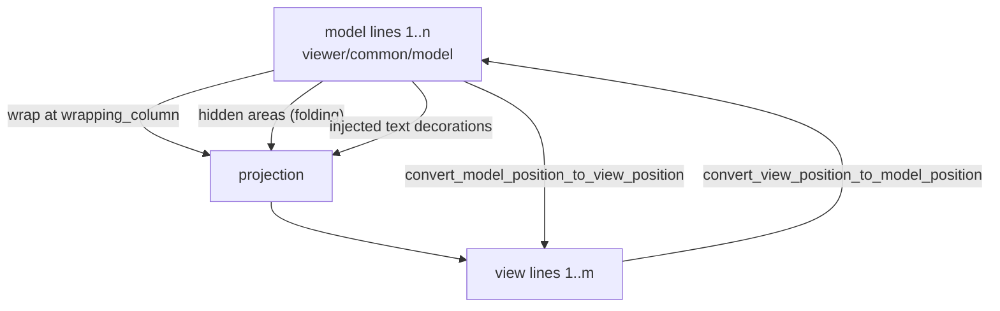

# viewer/common/view_model

Injected text, wrapping/folding projection, model/view conversion, and concrete
inline/model decoration resolution.

The model has *model lines*. The screen shows *view lines*. They are not the
same sequence: one model line can wrap into several view lines, a folded region
can hide model lines entirely, and injected text can add content the model does
not contain. This package owns that projection and the conversion in both
directions.



## Building a projection

`ViewModelLinesFromProjectedModel` is the projection itself; `ViewModel` is the
live owner that keeps it in sync with the model and publishes outgoing events.

Plain projected lines retain sparse spans instead of per-character column
maps; identity column conversions are arithmetic and injected boundaries use
binary search with the existing left/right affinity. Only a wrapping-column
change with unchanged font, indent, tab size, content and injections reuses
previous breaks. Backward tab searches restart from a preceding anchor, and
surrogate pairs remain indivisible. Extremely narrow columns and degenerate
previous segments take the complete algorithm to preserve full-computation
mapping behavior. Lines that fit do not allocate projected text at all.

Models above the construction-fixed 20MiB or 300,000-line tokenization threshold
use an implicit identity collection: no per-line projection/prefix arrays,
wrapping, injections or hidden areas. Queries still use the complete current
snapshot, including after a whole-value flush. Folding uses the same gate.

A wide wrapping column means no wrapping, so view lines and model lines
correspond one-to-one — the degenerate case worth seeing first.

```mbt check
///|
fn projection_model(text : String) -> @model.TextModel raise {
  TextModel(
    @base_common.Uri::parse("file:///view-model-doc.mbt"),
    "view-model-doc.mbt",
    "moonbit",
    1,
    "rev-1",
    text,
  )
}

///|
fn projection(
  text : String,
  wrapping_column~ : Int,
) -> @view_model.ViewModelLinesFromProjectedModel raise {
  ViewModelLinesFromProjectedModel(
    projection_model(text),
    font_info=@config.FontInfo::default(),
    tab_size=4,
    wrapping_column~,
    wrapping_indent=None,
  )
}

///|
test "with no wrapping, view lines and model lines coincide" {
  let lines = projection("alpha\nbeta\ngamma\n", wrapping_column=200)
  debug_inspect(
    (
      lines.get_view_line_count(),
      lines.get_view_line_content(2),
      lines.model_line_number_of_view_line(2),
      lines.convert_view_position_to_model_position(2, 1),
    ),
    content=(
      #|(4, "beta", 2, { line_number: 2, column: 1 })
    ),
  )
}
```

Narrow the wrapping column and one model line becomes several view lines. The
conversion is what keeps a caret, a selection, or a decoration pointing at the
right characters afterwards.

```mbt check
///|
test "wrapping splits one model line into several view lines" {
  let lines = projection(
    "aaaa bbbb cccc dddd eeee\nshort\n",
    wrapping_column=10,
  )
  debug_inspect(
    (
      lines.get_view_line_count(),
      [
        for view_line in 1..<=lines.get_view_line_count() => {
          (
            view_line,
            lines.get_view_line_content(view_line),
            lines.model_line_number_of_view_line(view_line),
          )
        }
      ],
    ),
    content=(
      #|(
      #|  5,
      #|  [
      #|    (1, "aaaa bbbb ", 1),
      #|    (2, "cccc dddd ", 1),
      #|    (3, "eeee", 1),
      #|    (4, "short", 2),
      #|    (5, "", 3),
      #|  ],
      #|)
    ),
  )
}
```

Conversion round-trips: a model position maps to a view position and back.

```mbt check
///|
test "model and view positions convert in both directions" {
  let lines = projection("aaaa bbbb cccc dddd eeee\n", wrapping_column=10)
  let view = lines.convert_model_position_to_view_position(1, 18)
  debug_inspect(
    (
      view,
      lines.convert_view_position_to_model_position(
        view.line_number,
        view.column,
      ),
    ),
    content=(
      #|({ line_number: 2, column: 8 }, { line_number: 1, column: 18 })
    ),
  )
}
```

## Hidden areas

Folding is expressed as *hidden areas* — model ranges the projection omits.
Nothing is deleted from the model; the view simply stops producing lines for
them, and `model_position_is_visible` reports the difference.

```mbt check
///|
test "a hidden area removes view lines without touching the model" {
  let lines = projection("one\ntwo\nthree\nfour\n", wrapping_column=200)
  let before = lines.get_view_line_count()
  let changed = lines.set_hidden_areas([Range(2, 1, 3, 6)])
  debug_inspect(
    (
      before,
      changed,
      lines.get_view_line_count(),
      lines.get_view_line_content(2),
      (
        lines.model_position_is_visible(1),
        lines.model_position_is_visible(2),
        lines.model_position_is_visible(4),
      ),
      lines.get_hidden_areas(),
    ),
    content=(
      #|(
      #|  5,
      #|  true,
      #|  3,
      #|  "four",
      #|  (true, false, true),
      #|  [
      #|    {
      #|      start_line_number: 2,
      #|      start_column: 1,
      #|      end_line_number: 3,
      #|      end_column: 1,
      #|    },
      #|  ],
      #|)
    ),
  )
}
```

Setting the same hidden areas again reports `false`, which is what lets the
folding contribution re-publish its state without forcing a re-render.

```mbt check
///|
test "re-setting identical hidden areas is not a change" {
  let lines = projection("one\ntwo\nthree\n", wrapping_column=200)
  let first = lines.set_hidden_areas([Range(2, 1, 2, 4)])
  let again = lines.set_hidden_areas([Range(2, 1, 2, 4)])
  debug_inspect(
    (first, again),
    content=(
      #|(true, false)
    ),
  )
}
```

## Live view models

`ViewModel` wraps a model and keeps the projection current. It exposes the line
reads the renderer needs and a `CoordinatesConverter` for callers that only want
the conversion.

```mbt check
///|
test "a live ViewModel exposes line reads and a converter" {
  let model = projection_model("alpha\nbeta\ngamma\n")
  let view_model = @view_model.ViewModel(model)
  debug_inspect(
    (
      view_model.line_count(),
      view_model.get_line_content(2),
      view_model.get_line_max_column(2),
      view_model.language_id(),
      view_model.model_position_is_visible(Position(2, 1)),
    ),
    content=(
      #|(4, "beta", 5, "moonbit", true)
    ),
  )
}
```

`to_model_visible_ranges` splits a view range into the model ranges it actually
covers, which is how a selection that spans a folded region becomes the correct
set of model ranges rather than one range straddling hidden text.

```mbt check
///|
test "a view range maps to the model ranges it really covers" {
  let model = projection_model("one\ntwo\nthree\nfour\n")
  let view_model = @view_model.ViewModel(model)
  debug_inspect(
    view_model.to_model_visible_ranges(Range(1, 1, 4, 5)),
    content=(
      #|[
      #|  {
      #|    start_line_number: 1,
      #|    start_column: 1,
      #|    end_line_number: 4,
      #|    end_column: 5,
      #|  },
      #|]
    ),
  )
}
```

`validate_model_position` clamps into the current document, so a stale position
from an earlier generation cannot escape into layout math.

```mbt check
///|
test "positions are validated against the current model" {
  let view_model = @view_model.ViewModel(projection_model("ab\ncd\n"))
  debug_inspect(
    (
      view_model.validate_model_position(Position(1, 1)),
      view_model.validate_model_position(Position(99, 99)),
    ),
    content=(
      #|({ line_number: 1, column: 1 }, { line_number: 3, column: 1 })
    ),
  )
}
```

## Injected text

Injected text is content the *view* shows and the model does not contain — an
inline type hint, for instance. It arrives as a model decoration, and the
projection splices it into the projected line.

`get_injected_text_at` answers whether a view position lands inside injected
text, which is what stops a caret from being placed in text that has no model
counterpart.

```mbt check
///|
test "a plain document has no injected text anywhere" {
  let view_model = @view_model.ViewModel(projection_model("let x = 1\n"))
  debug_inspect(
    (
      view_model.get_injected_text_at(Position(1, 5)),
      view_model.injected_text_index_at(Position(1, 5)),
    ),
    content=(
      #|(None, -1)
    ),
  )
}
```

## Pipeline and API

`ViewModel` owns the model, projected line collection, single cursor,
`ViewLayout`, decoration resolver, coordinate converter, and per-source hidden-area
sets. It is created once when a model attaches and updated in place.

```text
model line + grammar tokens + injected-text decorations
  -> ProjectedTextLine
  -> soft-wrap ModelLineProjection segments
  -> hidden-area filtering
  -> ViewLineData + model/view coordinate conversion
  -> viewport_data_from_view_model -> view_layout.ViewportData
```

- `ViewModelLinesFromProjectedModel` is always used. With wrapping disabled each
  line has a cheap identity projection; there is no separate
  `ViewModelLinesFromModelAsIs` implementation. Models above the tokenization
  safety thresholds remain on this projected collection and render default
  tokens; collection fallback belongs to the separate large-file plan.
- `CoordinatesConverter` is the closed concrete converter consumed by
  `ViewModel`, cursor closure construction, decorations, and browser input. Its
  current `Projected` arm retains `ViewModelLinesFromProjectedModel`; a future
  large-file as-is collection adds an identity arm without changing consumers.
- Injected text is projected before line breaking, so its width affects wrapping;
  source mappings, tokens, and decorations remain anchored to model offsets.
- Viewport construction uses one `get_view_lines_data` batch and a parallel
  needed mask. Each participating `Projected` model line constructs Monaco's
  five-callback injected-decoration context, computes absolute-view-line inline
  decorations, and performs one passive token-store read before examining the
  mask; therefore even an all-false mask reads once per projected model line.
  `Identity` retains Monaco's distinct early return and reads only when needed.
  The selected source-shaped decoration `Range` is adapted to the renderer's
  line-local offsets after `baseViewLineNumber` has been observed. No view read
  invokes the lexer.
- Configuration or injected-text/content flushes reproject affected state at the
  current whole-model granularity, invalidate decoration caches, and reproject the
  cursor from model coordinates. Incremental edit events are not part of the
  readonly contract.
- Cursor mutation has one source/reason-aware transition path. Model-side states
  validate through `TextModel`; view-side states clamp/normalize in this package
  and retain their authoritative projected position. Left/Right move by UTF-16
  scalar boundaries, Up/Down/Page move across wrapped view lines with visible-
  column residues, and Home/End choose the source model/view branch. Word/Line
  pointer continuation dispatches from the stored anchor kind. Source-shaped
  MoveTo and Line entries accept a required model position plus an optional
  already-known view position: absent converts model-to-view; supplied is kept
  only when its normalized view-to-model result matches the validated model
  position.
- `CursorMoveDirection` retains the source's full 15-member `Direction` enum;
  `SimpleMoveDirection` is its exact 11-member simple-move union, and
  `CursorMoveUnit` is the exact six-member `Unit` contract. Unscoped
  blank/wrapped-position and viewport directions, vertical model/folded units,
  and Left/Right HalfLine return without mutation at their explicit deferred
  branches.
- `CursorEventDispatcher` is the outgoing-only half of Monaco's
  `ViewModelEventDispatcher`: its heterogeneous queue carries cursor-state,
  ViewZones-changed, hidden-area-changed, and model-token facts. Cursor
  selection/version no-ops are filtered and queued cursor events can coalesce;
  the two payload-free change facts are always observable and merge only with
  their own kind, while model-token wrappers retain the identical source event,
  are never no-ops, and never merge. The dispatcher recursively drains
  reentrant outgoing facts and
  uses separate source-shaped listener-delivery state so a nested fire first
  finishes the remaining listeners for the current value. The nested value is
  then delivered before the initiating callback resumes. The root Viewer FIFO
  separately keeps public event pairs adjacent. It exposes
  `on_cursor_state_changed`, `on_view_zones_changed`,
  `on_hidden_areas_changed`, and `on_model_tokens_changed`;
  `ViewModel::dispose` disposes all emitters and clears pending outgoing facts
  and listener-
  delivery state. Generic browser View handlers, mixed view/outgoing
  collectors, and the editor-wide cross-event delivery queue remain outside
  this reduced common owner.
- Left/Right movement is surrogate-pair safe and otherwise advances one
  Unicode code point at a time. Full grapheme-cluster movement and the matching
  grapheme-segmented visible-column arithmetic remain deferred.
- `set_hidden_areas` merges ranges by source, updates line/layout/decorations/
  cursor, and preserves the top visible model line when folding changes above
  the viewport. Two optional owner continuations bridge the browser-package
  cycle without moving ViewEvents into this common package: the unchanged gate
  runs before `with_event_batch`; on a changed mapping,
  `on_line_mapping_changed` wraps the cursor continuation so the root appends
  Flushed/Mapping/Decorations, cursor, layout, and recovery-scroll facts in
  source order. The payload-free hidden-area outgoing event is emitted only
  when the projected line collection reports a real mapping change, and only
  after `with_event_batch` has returned, so layout and stable-viewport recovery
  are already complete. Equal inputs and force-updates whose mapping is still
  equal do not emit. Headless callers omit both continuations but retain the
  same changed-only outgoing event.
- `model_position_is_hidden_except_source` is the narrow ViewZones policy read:
  it tests the raw per-source ranges without rebuilding the cached union or
  changing the projected line collection.
- A ViewModel may borrow the exact attached-view handle owned by its root
  `ModelData`. Vertical scroll and content remapping publish current model
  visible ranges as unstable; initial setup and explicit view-state restore
  publish the stabilized state. Hidden model ranges are removed in order.
  Model token events are converted through the current projection, delivered
  synchronously to the browser ViewEvent callback, and only then enqueued as
  the original outgoing model event. The listener never forces tokenization.
- `ViewModelDecorations` owns the concrete, package-private inline-decoration
  computer. It queries canonical model decorations, converts ranges through
  the local `CoordinatesConverter`, caches resolved view decorations by
  decoration id, and resolves only the requested viewport. Model-decoration
  and line-mapping notifications clear that cache at the corresponding source
  invalidation boundaries.

## Inline-decoration ownership

The merged package keeps the Monaco source units distinct:

- `inline_decorations.mbt` maps
  `common/viewModel/inlineDecorations.ts`;
- `view_model_decoration.mbt` maps
  `common/viewModel/viewModelDecoration.ts`;
- `view_model_decorations.mbt` maps
  `common/viewModel/viewModelDecorations.ts` plus its called
  `viewModelLines.ts` range-query slice;
- `inline_decorations_reference_wbtest.mbt` maps
  `test/common/viewModel/inlineDecorations.test.ts` and retains all 23 source
  test names.
- `inline_decorations_matrix_wbtest.mbt` covers the additional branch and
  behavior-variable matrix recorded by the ownership plan: overlap/adjacency,
  whole-line and wrapped boundaries, endpoint visibility, invalidation,
  same-position/empty/wrapped injection edges, option/offset producer pairing,
  and consumer preconditions.

The four source-mapped artifacts are pinned to vscode commit
checked-in source; the local matrix derives its cases
from that same source revision and the approved Gate A behavior matrix.
Production uses concrete
`TextModel`, `ModelDecoration`, `ModelDecorationOptions`, and
`CoordinatesConverter` values. Only concrete `ViewModelDecoration` and
`ViewDecorationsCollection` cross the package boundary; computers, contexts,
resolved inputs, and renderer-facing inline values stay private. Injected-text
decoration computation has one owner beside `ModelLineProjection`, including
the source callback order, wrapped clipping, continuation indent, and absolute
base-view-line calculation.

The following source behavior remains explicitly deferred:

- comment/string token visibility, because canonical decoration options have
  no `hideInCommentTokens` or `hideInStringTokens` fields;
- the whole-line `allowZero=false` and `belowHiddenRanges=true` converter
  switches, because the canonical converter exposes affinity only;
- production `beforeContentClassName` reach, because the canonical model
  options lack that field;
- production `affectsFont` reach, because the canonical model options lack
  font-decoration inputs;
- production injected-text letter-spacing reach, because canonical injected
  options lack `inlineClassNameAffectsLetterSpacing`.

The white-box suite uses private resolved-input adapters for the last three
branches. Those cases prove the source algorithms, not product reachability;
the five entries remain `DEFERRED` in the execution-plan ledger.

Run the exact source-named conformance suite with:

```sh
moon test --target js viewer/common/view_model/inline_decorations_reference_wbtest.mbt
moon test --target native viewer/common/view_model/inline_decorations_reference_wbtest.mbt
```

Run the additional local branch matrix with:

```sh
moon test --target js viewer/common/view_model/inline_decorations_matrix_wbtest.mbt
moon test --target native viewer/common/view_model/inline_decorations_matrix_wbtest.mbt
```

There are no `FrameSource`, `FrameViewport`, `RenderLine`, or `RenderFrame` APIs;
browser code consumes `ViewModel` plus `view_layout.ViewportData`. Selection/copy
helpers belong to `viewer/common/core` and the root `viewer`, not this package.

The upstream map is the pinned `src/vs/editor/common/viewModel/` files
`viewModelImpl.ts`, `viewModelLines.ts`, `modelLineProjection.ts`,
`monospaceLineBreaksComputer.ts`, `inlineDecorations.ts`,
`viewModelDecoration.ts`, and `viewModelDecorations.ts`, plus
`viewLayout/viewLinesViewportData.ts`.
This package must remain multi-target and FFI-free, with no root-viewer, browser,
server, transport, workspace, or host dependency. See `pkg.generated.mbti`; run
`moon test --target js viewer/common/view_model` and
`moon test --target native viewer/common/view_model`.
